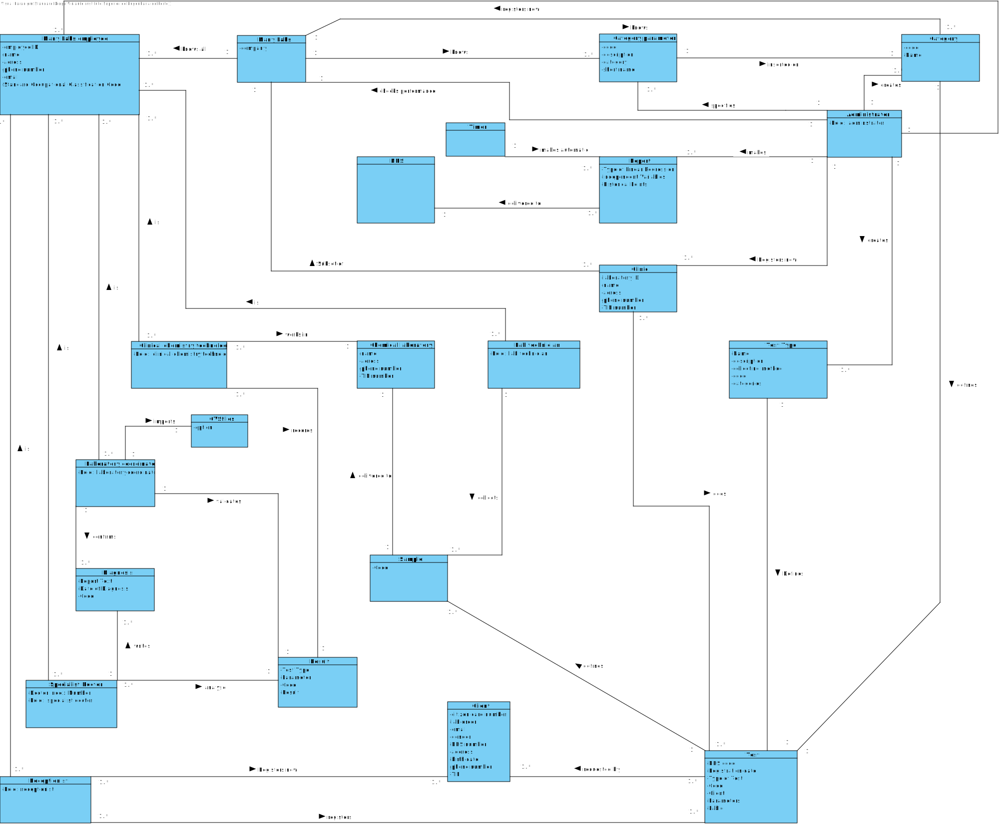

# OO Analysis #

The construction process of the domain model is based on the client specifications, especially the nouns (for _concepts_) and verbs (for _relations_) used. 

## Rationale to identify domain conceptual classes ##
To identify domain conceptual classes, start by making a list of candidate conceptual classes inspired by the list of categories suggested in the book "Applying UML and Patterns: An Introduction to Object-Oriented Analysis and Design and Iterative Development". 

### _Conceptual Class Category List_ ###

**Business Transactions**

*

---

**Transaction Line Items**

*

---

**Product/Service related to a Transaction or Transaction Line Item**

*  

---

**Transaction Records**

*  

---  

**Roles of People or Organizations**

* Client: take a test and receive the results.
* Recepcionist: register a new client and the test to be performed.
* Medical lab technician: record the samples collected in the scope of a given test in the system.
* Clinical chemistry technologist: perform the chemical analysis.
* Specialist doctor: analyse the results and write the report of the diagnosis.
* Laboratory coordinator: check the chemical test/result and associate diagnosis made and confirm that everything was done correctly.
* Many Labs employee: find a client's info.
* NHS: receive a report of covid-19 data.
* Administrator: specify a new type of test and its collecting methods, specify a new test parameter and categorize it and specify a new parameter category.

---

**Places**

* Chemical laboratory
* Many Labs Headquarters
* Clinical 

---

**Noteworthy Events**

* 

---

**Physical Objects**

* Samples.

---

**Descriptions of Things**

*  

---

**Catalogs**

* Covid test.
* Blood analyses.
* Other analyses.

---

**Containers**

*  

---

**Elements of Containers**

*  

---

**Organizations**

* NHS. 
* Many Labs.

---

**Other External/Collaborating Systems**

*  

---

**Records of finance, work, contracts, legal matters**

* 

---

**Financial Instruments**

*  

---

**Documents mentioned/used to perform some work/**

* The application user manual.
* Report.
---

| Concept (A) 		|  Association   	|  Concept (B) |
|----------	   		|:-------------:		|------:       |
| Receptionist 	| registers   		 	| Client  |
| Clinic  	| subset of    		 	| Many Labs  |
| Clinic	|    does 		 	| Test  |
| Administrator  	| creates    		 	| Test  |
| Test  	| requested by    		 	| Client  |
| Sample  	| for    		 	|Test  |
| Lab technician  	| collects   		 	| Sample  |
| Sample  	| Delivered   		 	| Chemical Laboratory  |
| Clinical Chemistry Technologist  	| works in    		 	| Chemical Laboratory  |
| Clinical Chemistry Technologist  	| records    		 	| Result  |
| Laboratory Coordinator  	| validates    		 	| Result  |
| Specialist Doctor  	| analyse    		 	| Result  |

## Domain Model

**Do NOT forget to identify concepts atributes too.**

**Insert below the Domain Model Diagram in a SVG format**

