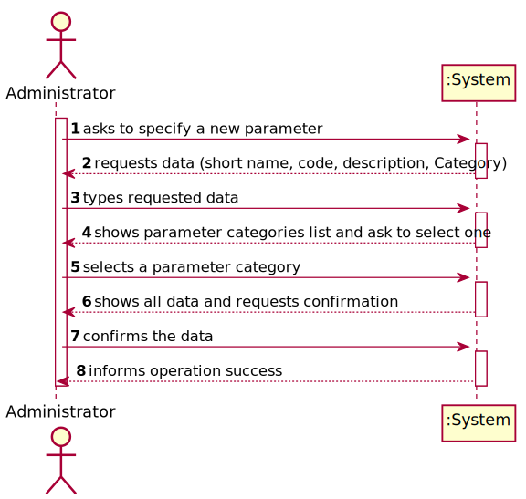
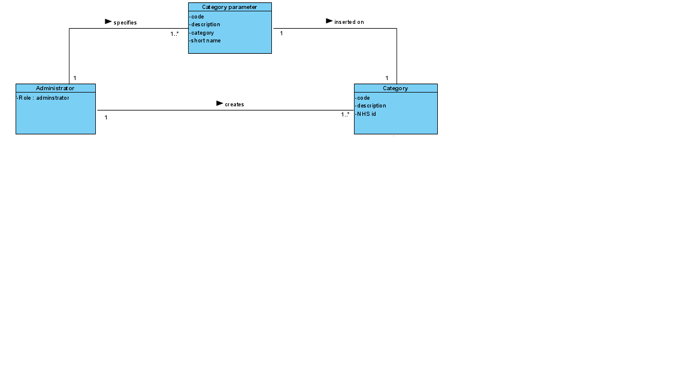
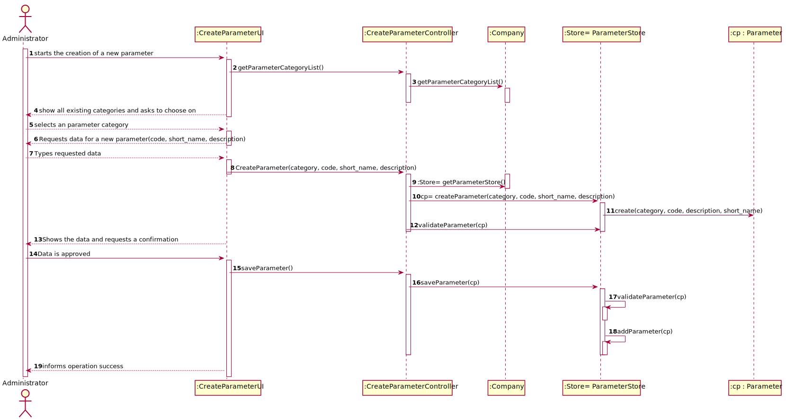
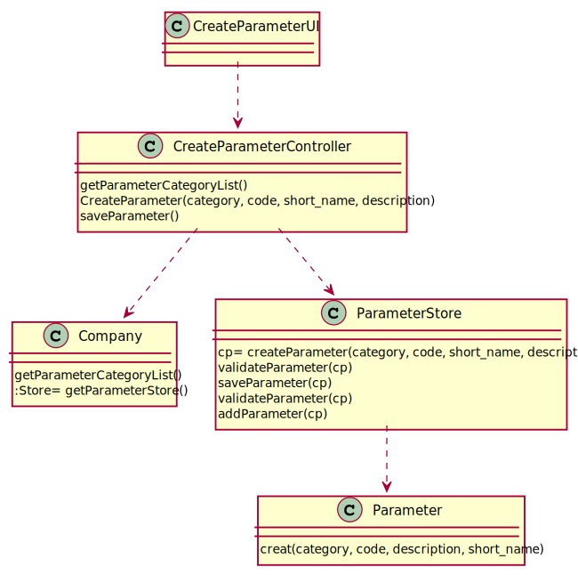

# US 010 - To specify a new parameter and categorize it 

## 1. Requirements Engineering

### 1.1. User Story Description

As an administrator, i want to specify a new parameter and categorize it.

### 1.2. Customer Specifications and Clarifications 

**From the specifications document:**

>	“Blood tests are frequently characterized by measuring several parameters which for presentation/reporting purposes are organized
by categories. For example, parameters such as the number of Red Blood Cells (RBC), White Blood Cells (RBC) and Platelets (PLT) are
usually presented under the blood count (Hemogram) category.”

>	“Regardless, such tests rely on measuring one or more parameters that can be grouped/organized by categories.”

**From the client clarifications:**

> **Question :** Does the administrator need to log in order to create a parameter and categorize it?
>
> **Answer :** Yes.

> **Question :** Can a parameter be classified in more than one parameter category?

> **Answer :** No. Each parameter has only one category. There are no subcategories.

> **Question :** How does the assignment of a parameter category works? Does he have to select the category or he have the option to create in the moment?
>
> **Answer :** There exists a user story to specify a new parameter category. Therefore, the administrator should select one category when creating a parameter.

> **Question :** Does the client want to specify more than one new parameter at a time?
> 
> **Answer :** Yes.

> **Question :** When a new parameter is specified, should there always be a category it falls under prior to its specification and subsequent categorization?
>
> **Answer :** Each parameter is associated with one category.

> **Question :** When a new parameter is specified, should there always be a category it falls under prior to its specification and subsequent categorization?
>
> **Answer :** Each parameter is associated with one category.

> **Question :** What is the data that characterize a parameter? Should we follow the same data as the parameter category, for example, would each parameter have its own code, description and NHS identifier?
>
> **Answer :** Each parameter is associated with one category. Each parameter has a Code, a Short Name and a Description.

### 1.3. Acceptance Criteria

* **AC1:** One parameter belongs to only one category.
* **AC2:** The Code are five alphanumeric characters.
* **AC3:** The Short Name is a String with no more than 8 characters.
* **AC4:** The Description is a String with no more than 20 characters.

### 1.4. Found out Dependencies

* There is a dependency to "US011 Create a parameter category" since at least a parameter category must exist to classify the category being created.

### 1.5 Input and Output Data

**Input Data:**

* Typed data:
	* Short name, 
	* Code, 
	* Description,
	* Category.
	
* Selected data:
	*  

**Output Data:**
* List of all parameters
* New categorizes parameter
* (In)Success of the operation

### 1.6. System Sequence Diagram (SSD)

**Other alternatives might exist.**

### 1.7 Other Relevant Remarks

## 2. OO Analysis

### 2.1. Relevant Domain Model Excerpt 

### 2.2. Other Remarks

n/a

## 3. Design - User Story Realization 

### 3.1. Rationale

**SSD - Alternative 1 is adopted.**

| Interaction ID | Question: Which class is responsible for... | Answer  | Justification (with patterns)  |
|:-------------  |:--------------------- |:------------|:---------------------------- |
| Step 1  		 |	... interacting with the actor? | CreateParameterUI   |  Pure Fabrication: there is no reason to assign this responsibility to any existing class in the Domain Model.           |
| 			  		 |	... coordinating the US? | CreateParameterController | Controller                             |
| 			  		 |	... instantiating a new Task? | Administrator   | Creator (Rule 1): in the DM Administrator has a Task.   |
| 			  		 | ... knowing the user using the system?  | UserSession  | IE: cf. A&A component documentation.  |
| 			  		 |	... knowing to which organization the user belongs to? | Platform  | IE: has registed all Organizations |
| 			  		 |							 | Many_Labs   | IE: knows/has its own Employees|
| 			  		 |							 | Employee  | IE: knows its own data (e.g. email) |
| Step 2  		 |							 |             |                              |
| Step 3  		 |	...saving the inputted data? | Parameter  | IE: object created in step 1 has its own data.  |
| Step 4  		 |	...knowing the parameter categories to show? | Platform  | IE: Parameter Categories are defined by the Platform. |
| Step 5  		 |	... saving the selected category? | Parameter  | IE: object created in step 1 is classified in one Category.  |
| Step 6  		 |							 |             |                              |              
| Step 7  		 |	... validating all data (local validation)? | Parameter | IE: owns its data.| 
| 			  		 |	... validating all data (global validation)? | Many_Labs | IE: knows all its tasks.| 
| 			  		 |	... saving the created task? | Many_Labs | IE: owns all its tasks.| 
| Step 8  		 |	... informing operation success?| CreateParameterUI  | IE: is responsible for user interactions.  | 

### Systematization ##

According to the taken rationale, the conceptual classes promoted to software classes are: 

 * Company

Other software classes (i.e. Pure Fabrication) identified: 

 * CreateTaskUI  
 * CreateTaskController

## 3.2. Sequence Diagram (SD)

## 3.3. Class Diagram (CD)

# 4. Tests 

**Test 1:** Check that it is not possible to create an instance of the Task class with null values. 

	@Test(expected = IllegalArgumentException.class)
		public void ensureNullIsNotAllowed() {
		Task instance = new Task(null, null, null, null, null, null, null);
	}
	

**Test 2:** Check that it is not possible to create an instance of the Task class with a reference containing less than five chars - AC2. 

	@Test(expected = IllegalArgumentException.class)
		public void ensureReferenceMeetsAC2() {
		Category cat = new Category(10, "Category 10");
		
		Task instance = new Task("Ab1", "Task Description", "Informal Data", "Technical Data", 3, 3780, cat);
	}

*It is also recommended to organize this content by subsections.* 

# 5. Construction (Implementation)

## Class CreateTaskController 

		public boolean createTask(String ref, String designation, String informalDesc, 
			String technicalDesc, Integer duration, Double cost, Integer catId)() {
		
			Category cat = this.platform.getCategoryById(catId);
			
			Organization org;
			// ... (omitted)
			
			this.task = org.createTask(ref, designation, informalDesc, technicalDesc, duration, cost, cat);
			
			return (this.task != null);
		}

## Class Organization

		public Task createTask(String ref, String designation, String informalDesc, 
			String technicalDesc, Integer duration, Double cost, Category cat)() {
		
	
			Task task = new Task(ref, designation, informalDesc, technicalDesc, duration, cost, cat);
			if (this.validateTask(task))
				return task;
			return null;
		}

# 6. Integration and Demo 

* A new option on the Employee menu options was added.

* Some demo purposes some tasks are bootstrapped while system starts.

# 7. Observations

Platform and Organization classes are getting too many responsibilities due to IE pattern and, therefore, they are becoming huge and harder to maintain. 

Is there any way to avoid this to happen?

