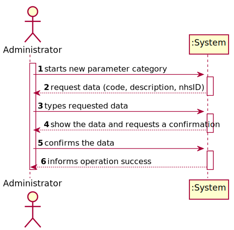

# US 011 - Create Parameter Category

## 1. Requirements Engineering

### 1.1. User Story Description

As an administrator, I want to specify a new parameter category.

### 1.2. Customer Specifications and Clarifications 

**From the specifications document:**

>	“Blood tests are frequently characterized by measuring several parameters which for presentation/reporting purposes are organized
by categories. For example, parameters such as the number of Red Blood Cells (RBC), White Blood Cells (RBC) and Platelets (PLT) are
usually presented under the blood count (Hemogram) category.”

>	“Regardless, such tests rely on measuring one or more parameters that can be grouped/organized by categories.”

**From the client clarifications:**

> **Question:** What are the data that characterize a parameter category?
>  
> **Answer:** Simply consider a code, a description and an NHS identifier.

> **Question:** WDoes the client want to specify more than one new parameter at a time?
>
> **Answer:** Yes.

> **Question:** When a new parameter is specified, should there always be a category it falls under prior to it's specification and subsequent categorization?
>
> **Answer:** Each parameter is associated with one category

### 1.3. Acceptance Criteria

* **AC1:** Code must be unique having 4 to 8 chars.
* **AC2:** Description cannot be empty and has, at maximum, 40 chars.
* **AC3:** NHS identifier is not mandatory.
* **AC4:** There are no subcategories.

### 1.4. Found out Dependencies

* No dependencies were found.

### 1.5 Input and Output Data

**Input Data:**

* Typed data:
	* code 
	* description
	* NHS identified	
	
	
* Selected data:
	* (none)

**Output Data:**

* (In)Success of the operation

### 1.6. System Sequence Diagram (SSD)

**Other alternatives might exist.**

### 1.7 Other Relevant Remarks

* The created task stays in a "not published" state in order to distinguish from "published" tasks.

## 2. OO Analysis

### 2.1. Relevant Domain Model Excerpt 

### 2.2. Other Remarks

n/a

## 3. Design - User Story Realization 

### 3.1. Rationale

**SSD - Alternative 1 is adopted.**

| Interaction ID | Question: Which class is responsible for... | Answer  | Justification (with patterns)  |
|:-------------  |:--------------------- |:------------|:---------------------------- |
| Step 1  		 |	... interacting with the actor? | CreateParameterUI   |  Pure Fabrication: there is no reason to assign this responsibility to any existing class in the Domain Model.           |
| 			  		 |	... coordinating the US? | CreateParameterController | Controller                             |
| 			  		 |	... instantiating a new Parameter? | Administrator   | Creator (Rule 1): in the DM Administrator creates a parameter.   |
| 			  		 | ... knowing the user using the system?  | UserSession  | IE: Auth component documentation.  |
| 			  		 |	... knowing to which organization the user belongs to? | Platform  | IE: has registed all Organizations |
| 			  		 |							 | Many Labs  | IE: knows/has its own Employees|
| 			  		 |							 | Employee  | IE: knows its own data (e.g. email) |
| Step 2  		 |							 |             |                              |
| Step 3  		 |	...saving the inputted data? | Parameter  | IE: object created in step 1 has its own data.  |
| Step 4  		
| Step 5  		 |	... validating all data (local validation)? | Parameter  | IE: owns its data.  |
|		  		 |	... validating all data (global validation)? | Many Labs   | IE: knows all its parameters.   |              
|		  		 |	...  saving the created task? | Many Labs | IE: owns all its data.| 
| Step 6         |                 |                |                 |                      

### Systematization ##

According to the taken rationale, the conceptual classes promoted to software classes are: 

 * Organization
 * Platform
 * Task

Other software classes (i.e. Pure Fabrication) identified: 

 * CreateTaskUI  
 * CreateTaskController

## 3.2. Sequence Diagram (SD)

## 3.3. Class Diagram (CD)

# 4. Tests 

**Test 1:** Check that it is not possible to create an instance of the Task class with null values. 

	@Test(expected = IllegalArgumentException.class)
		public void ensureNullIsNotAllowed() {
		Task instance = new Task(null, null, null, null, null, null, null);
	}
	

**Test 2:** Check that it is not possible to create an instance of the Task class with a reference containing less than five chars - AC2. 

	@Test(expected = IllegalArgumentException.class)
		public void ensureReferenceMeetsAC2() {
		Category cat = new Category(10, "Category 10");
		
		Task instance = new Task("Ab1", "Task Description", "Informal Data", "Technical Data", 3, 3780, cat);
	}

*It is also recommended to organize this content by subsections.* 

# 5. Construction (Implementation)

## Class ParameterCategory

		private String code;
		private String description;
		private String nhsId;
	
		public ParameterCategory(String code, String description, String nhsId) {
			checkCodeRules(code);
			checkDescriptionRules(description);
			this.code = code;
			this.description = description;
			this.nhsId = nhsId;
		}
			
		private void checkCodeRules(String code) {
			if (StringUtils.isBlank(code))
				throw new IllegalArgumentException("Code cannot be blank.");
			if ( (code.length() < 4) || (code.length() > 8))
				throw new IllegalArgumentException("Code must have 4 to 8 chars.");
		}

		private void checkDescriptionRules(String description){ …}

## Class  Company

		private List<ParameterCategory> parameterCategoryList;
		
		public ParameterCategory createParameterCategory(String code, String description, String nhsId) {
			return new ParameterCategory(code, description, nhsId);
		}

		public boolean validateParameterCategory(ParameterCategory pc) {
			if (pc == null)
				return false;
			return ! this.parameterCategoryList.contains(pc);
		}

		public boolean saveParameterCategory(ParameterCategory pc) {
			if (!validateParameterCategory(pc))
				return false;
			return this.parameterCategoryList.add(pc);
		}

## Class  CreateParameterCategoryController

     	private Company company;
		private ParameterCategory pc;

		public CreateParameterCategoryController() {
			this(App.getInstance().getCompany());
		}

		public CreateParameterCategoryController(Company company) {
			this.company = company;
			this.pc = null;
		}

		public boolean createParameterCategory(String code, String description, String nhsId) {
			this.pc = this.company.createParameterCategory(code, description, nhsId);
			return this.company.validateParameterCategory(pc);
		}

		public boolean saveParameterCategory() {
			return this.company.saveParameterCategory(pc);
		}	

# 6. Integration and Demo 

* A new option on the Employee menu options was added.

* Some demo purposes some tasks are bootstrapped while system starts.

# 7. Observations

Platform and Organization classes are getting too many responsibilities due to IE pattern and, therefore, they are becoming huge and harder to maintain. 

Is there any way to avoid this to happen?

