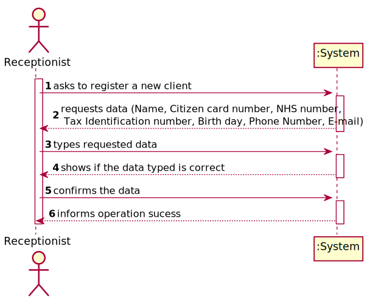
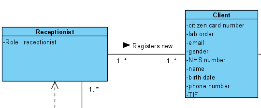
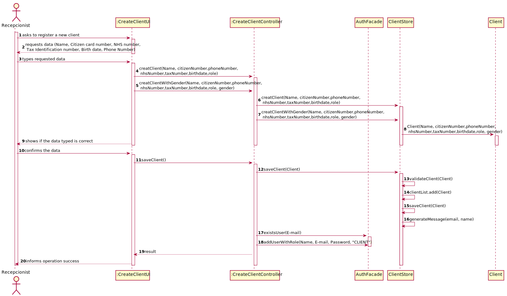
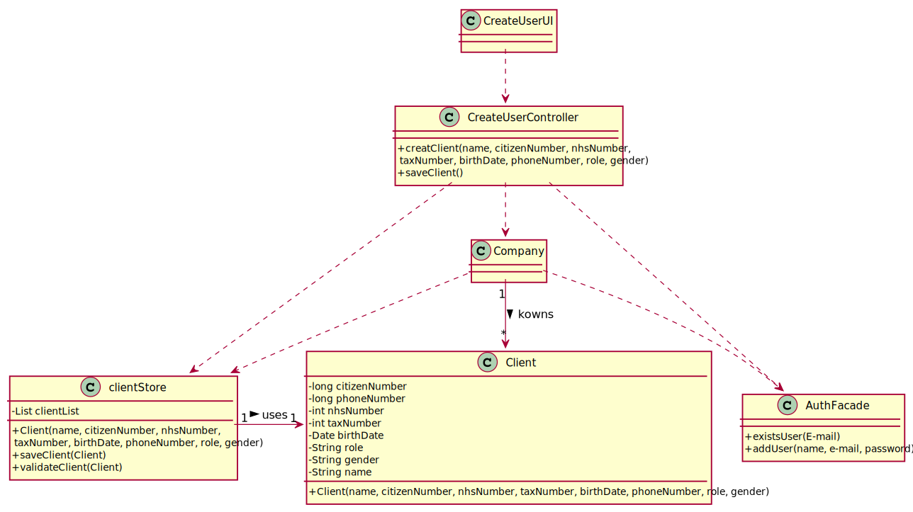

# US 003 - To register a client 

## 1. Requirements Engineering

### 1.1. User Story Description

• As a receptionist of the laboratory, I want to register a new client.

### 1.2. Customer Specifications and Clarifications 

**From the specifications document:**

>	Typically, the client arrives at one of the clinical analysis laboratories with a lab order prescribed by
a doctor. Once there, a receptionist asks the client’s citizen card number, the lab order (which
contains the type of test and parameters to be measured), and registers in the application the test to
be performed to that client.

>	In case of a new client, the receptionist registers the client in the application. To register a client, the
receptionist needs the client’s citizen card number, National Healthcare Service (NHS) number,
birth date, sex, Tax Identification number (TIF), phone number, e-mail and name. 

**From the client clarifications:**

> **Question:** Which style format should the different client informations have?
>  
> **Answer:** Citizen Card:16 digit number; NHS: 10 digit number; TIN: 10 digit number; Birth day: DD/MM/YY; Sex: Male/Female; Phone Number: 11 digit number.

-

> **Question:** Which fields are required/mandatory?
>  
> **Answer:** The gender is optional. All other fields are required.

-

> **Question:** Does the receptionist need to be logged in the app to preform the regist.
> 
> **Answer:** Yes.

-

> **Question:** What parameter (asked by the receptionist) should the system use to create the password of the new client
>
> **Answer:** The password should be randomly generated. It should have ten alphanumeric characters.

-

> **Question:** Can the client change their password whenever they want?
>
> **Answer:** No.

-

> **Question:**  Does the email have to be validated as a valid address or do we just accept whatever input the receptionist writes?
> 
> **Answer:** You should use a regular expression to validate the e-mail address.

-

> **Question:** What should be the maximum length of the String with the name of the Client?
> 
> **Answer:** A string with no more than 35 characters.

### 1.3. Acceptance Criteria

* **AC1:** The client must become a system user. The "auth" component
  available on the repository must be reused (without modifications).
* **AC2:** A client should not have more than 150 years of age.
* **AC3:** The password should be randomly generated. It should have ten alphanumeric character.
* **AC4:** The name must be a string with no more than 35 characters.
* **AC5:** Citizen card number should be a 16-digit number.
* **AC6:** NHS and TIN number should be 10-digits numbers.
* **AC7:** Birthdate format should be DD/MM/YY.
* **AC8:** Gender options are Male/Female and are optional.
* **AC9:** Phone number should be a 11-digit number.
* **AC10:** The client receives an e-mail informing that the registration was successful and that he can start to use the system. The e-mail includes the client password. All the e-mail messages should be written to a file with the name emailAndSMSMessages.txt.

### 1.4. Found out Dependencies

* There were no dependencies found.

### 1.5 Input and Output Data

**Input Data:**

* Typed data:
	* Name,
	* Citizen Card number, 
	* NHS number, 
	* Tax Identification number ,
	* Birthdate ,
	* Phone Number, 
	* Role.
	* Gender .
	
* Selected data:
	* n/a 

**Output Data:**

* User registration sheet.
* (In)Success of the operation

### 1.6. System Sequence Diagram (SSD)

**Alternative 1**

**Other alternatives might exist.**

### 1.7 Other Relevant Remarks

* The user's information becomes available for all the employees of Many Labs.

## 2. OO Analysis

### 2.1. Relevant Domain Model Excerpt 

### 2.2. Other Remarks

n/a

## 3. Design - User Story Realization 

### 3.1. Rationale

**SSD - Alternative 1 is adopted.**

| Interaction ID | Question: Which class is responsible for... | Answer  | Justification (with patterns)  |
|:-------------  |:--------------------- |:------------|:---------------------------- |
| Step 1  		 |	... interacting with the actor? | CreateClientUI   |  Pure Fabrication: there is no reason to assign this responsibility to any existing class in the Domain Model.           |
| 			  		 |	... coordinating the US? | CreateClientController | Controller                             |
| 			  		 | ... knowing the user using the system?  | UserSession  | IE: Auth component documentation.  |
| 			  		 |	... knowing to which organization the user belongs to? | Company  | IE: has registed all Organizations |
| 			  		 |							 | Company   | IE: knows/has its own Employees|
| 			  		 |							 | Client  | IE: knows its own data (e.g. email) |
| Step 2  		 |							 |             |                              |
| Step 3  		 |	...saving the inputted data? | Client  | IE: object created in step 1 has its own data.  |
|                  |	... instantiating a new Client? | ClientStore   | 	Creator (R1) and HC+LC: By the application of the Creator (R1) it would be the "Company". But, by applying HC + LC to the "Company", this delegates that responsibility to the "ClientStore".   |
|                  |  ... knows ClientStore?	 |  Company   |  **IE:** Company knows the ClientStore to which it is delegating some tasks |
|  		             |	... validating all data (local validation)? | Client | **IE:** an object knows its data|
| 			  		 |	... validating all data (global validation)? | ClientStore | **IE:** knows all the clients| 
|                    | ... validate the exclusivity of the client's email? | AuthFacade | **IE:** user management is responsibility of the respective external component whose point of interaction is through the class "AuthFacade"
| Step 4  		 |	 | |                         |              
| Step 5  		 |	... generating the password? | Password | **IE** and **Pure Fabrication:** ClientStore has all the required information and means to generate the password (IE). However, to avoid code duplication (cf. US7) this responsibility might be assign to a common and shared artificial class, specialized in this task.|
| 			  		 |	... registering the client as a system user? | AuthFacade | **IE:** cf. A&A component documentation | 
| 			  		 |	... saving the client? | ClientStore | **IE:** Knows all clients| 
| Step 6  		 |	... informing operation success?| CreateClientUI  | IE: is responsible for user interactions.  |  

### Systematization ##

According to the taken rationale, the conceptual classes promoted to software classes are: 

 * Company
 * Client

Other software classes (i.e. Pure Fabrication) identified: 

 * CreatClientUI
 * CreateClientController
 * ClientStore
 * Password

Other software classes of external systems/components:

 * AuthFacade

## 3.2. Sequence Diagram (SD)

**Alternative 1**

## 3.3. Class Diagram (CD)

**From alternative 1**

# 4. Tests 

**Test 1:** Check that a client is created. 

	@Test
    public void createClientWithGenderRight() {
        this.client.createClientWithGender("violas", 1234567891234567L, 12345678971L, 1234567891, 1234567891, new Date("2002/3/30"), "Client", "MALE", new Email("dsviolante@gmail.com"));
    }
	

**Test 2:** Check that it is not possible to create a Client when disrespecting the AC's. 

	@Test(expected = IllegalArgumentException.class)
    public void createClientWithGenderWrong1() {
        this.client.createClientWithGender("violas", 12345678912345L, 12345678971L, 1234567891, 1234567891, new Date("2002/3/30"), "Client", "MALE", new Email("dsviolante@gmail.com"));
    }
    @Test(expected = IllegalArgumentException.class)
    public void createClientWithGenderWrong2() {
        this.client.createClientWithGender("violas", 1234567891234567L, 1234567897L, 1234567891, 1234567891, new Date("2002/3/30"), "Client", "MALE", new Email("dsviolante@gmail.com"));
    }
    @Test(expected = IllegalArgumentException.class)
    public void createClientWithGenderWrong3() {
        this.client.createClientWithGender("violas", 1234567891234567L, 12345678971L, 123456789, 1234567891, new Date("2002/3/30"), "Client", "MALE", new Email("dsviolante@gmail.com"));
    }
    @Test(expected = IllegalArgumentException.class)
    public void createClientWithGenderWrong4() {
        this.client.createClientWithGender("violas", 1234567891234567L, 12345678971L, 1234567891, 123456789, new Date("2002/3/30"), "Client", "MALE", new Email("dsviolante@gmail.com"));
    }
    @Test(expected = IllegalArgumentException.class)
    public void createClientWithGenderWrong5() {
        this.client.createClientWithGender("qwertyuiopasdfghjklçzxcvbnmklçpokijuh", 1234567891234567L, 12345678971L, 1234567891, 1234567891, new Date("2002/3/30"), "Client", "MALE", new Email("dsviolante@gmail.com"));
    }
    @Test(expected = IllegalArgumentException.class)
    public void createClientWithGenderWrong6() {
        this.client.createClientWithGender("", 1234567891234567L, 12345678971L, 1234567891, 1234567891, new Date("2002/3/30"), "Client", "MALE", new Email("dsviolante@gmail.com"));
    }
    @Test(expected = IllegalArgumentException.class)
    public void createClientWithGenderWrong7() {
        this.client.createClientWithGender("violas", 1234567891234567L, 12345678971L, 1234567891, 1234567891, new Date("2002/3/30"), "", "MALE", new Email("dsviolante@gmail.com"));
    }
    @Test(expected = IllegalArgumentException.class)
    public void createClientWithGenderWrong8() {
        this.client.createClientWithGender("violas", 1234567891234567L, 12345678971L, 1234567891, 1234567891, new Date("2002/3/30"), "Client", "", new Email("dsviolante@gmail.com"));
    }
    @Test(expected = IllegalArgumentException.class)
    public void createClientWithGenderWrong9() {
        this.client.createClientWithGender("violas", 1234567891234567L, 12345678971L, 1234567891, 1234567891, new Date("1800/3/30"), "Client", "MALE", new Email("dsviolante@gmail.com"));
    }
    @Test(expected = IllegalArgumentException.class)
    public void createClientWithGenderWrong10() {
        this.client.createClientWithGender("violas", 1234567891234567L, 12345678971L, 1234567891, 1234567891, new Date("2002/3/30"), "Client", "MALE", new Email(""));
    }

*It is also recommended to organize this content by subsections.* 

# 5. Construction (Implementation)

## Class CreateClientController 

		package app.controller;

	import app.domain.Store.ClientStore;
	import app.domain.model.Client;
	import app.domain.model.Company;
	import auth.AuthFacade;
	import auth.UserSession;
	import auth.domain.model.Email;
	import java.io.IOException;
	import java.util.Date;

	public class CreateClientController {

    /**
     * attribute from ClientStore Class.
     */
    private final ClientStore store = new ClientStore();
    /**
     * attribute from Company Class.
     */
    private final Company company;
    /**
     * attribute from Client Class.
     */
    private Client client;
    /**
     * attribute from AuthFacade Class.
     */
    private final AuthFacade authFacade = new AuthFacade();

    /**
     * Constructor for CreateClientController Class.
     */
    public CreateClientController() {
        this.company = App.getInstance().getCompany();
    }

    /**
     * Method that checks if the Receptionist is logged in and calls createClient from ClientStore.
     * @param name name of the Client.
     * @param citizenNumber Citizen number of the Client.
     * @param phoneNumber Phone number of the client.
     * @param nhsNumber NHS number of the Client.
     * @param taxNumber Tax Identification number of the Client.
     * @param birthDate Birthdate of the Client.
     * @param role Role of the Client.
     * @param email Email of the Client.
     */
    public void createClient(String name, long citizenNumber, long phoneNumber,  int nhsNumber, int taxNumber, Date birthDate, String role, Email email) {
        UserSession userSession = authFacade.getCurrentUserSession();

        if(userSession.isLoggedInWithRole("RECEPTIONIST")) {
            this.client = this.store.createClient(name, citizenNumber, phoneNumber, nhsNumber, taxNumber, birthDate, role, email);
            this.store.validateClient(this.client);
        }
    }

    /**
     * Method that checks if the Receptionist is logged in and calls createClient from ClientStore.
     * @param name name of the Client.
     * @param citizenNumber Citizen number of the Client.
     * @param phoneNumber Phone number of the client.
     * @param nhsNumber NHS number of the Client.
     * @param taxNumber Tax Identification number of the Client.
     * @param birthDate Birthdate of the Client.
     * @param role Role of the Client.
     * @param gender Gender of the Client.
     * @param email Email of the Client.
     */
    public void createClientWithGender(String name, long citizenNumber, long phoneNumber,  int nhsNumber, int taxNumber, Date birthDate, String role, String gender, Email email) throws IOException {
        UserSession userSession= authFacade.getCurrentUserSession();

        if(userSession.isLoggedInWithRole("RECEPTIONIST")) {
            this.client = this.store.createClientWithGender(name, citizenNumber, phoneNumber, nhsNumber, taxNumber, birthDate, role, gender, email);
            this.store.validateClient(this.client);
        }
    }

    /**
     * Method to save the client in the System by calling saveClient from ClientStore.
     */
    public void saveClient () {
        this.store.saveClient(this.client);
    }
}

## Class Client

		package app.domain.model;

	import auth.domain.model.Email;
	import org.apache.commons.lang3.StringUtils;
	import java.util.Calendar;	
	import java.util.Date;

	public class Client {
	/**
	* Client's name.
	*/
	private String name;
/**
* Client's citizen number.
*/
private long citizenNumber;
/**
* Client's phone number.
*/
private final long phoneNumber;
/**
* Client's NHS number.
*/
private int nhsNumber;
/**
* Client's Tax Identification number.
*/
private int taxNumber;
/**
* Client's birthdate.
*/
private Date birthDate;
/**
* Client's role.
*/
private String role;
/**
* Client's gender.
*/
private String gender;
/**
* Client's email.
*/
private final Email email;

    /**
     * Constructor of Client Class.
     * @param name name of the Client.
     * @param citizenNumber Citizen number of the Client.
     * @param phoneNumber Phone number of the client.
     * @param nhsNumber NHS number of the Client.
     * @param taxNumber Tax Identification number of the Client.
     * @param birthDate Birthdate of the Client.
     * @param role Role of the Client.
     * @param gender Gender of the Client.
     * @param email Email of the Client.
     */
    public Client(String name, long citizenNumber, long phoneNumber,  int nhsNumber, int taxNumber, Date birthDate, String role, String gender, Email email) {
        validateName(name);
        this.name = name;

        validateCitizenNumber(String.valueOf(citizenNumber));
        this.citizenNumber = citizenNumber;

        validatePhoneNumber(String.valueOf(phoneNumber));
        this.phoneNumber = phoneNumber;

        validateNHSNumber(String.valueOf(nhsNumber));
        this.nhsNumber = nhsNumber;

        validateTIN(String.valueOf(taxNumber));
        this.taxNumber = taxNumber;

        validateRole(role);
        this.role = role;

        validateDate(birthDate);
        this.birthDate = birthDate;

        validateGender(gender);
        this.gender = gender;

        this.email = email;

    }

    /**
     * Constructor of Client Class.
     * @param name name of the Client.
     * @param citizenNumber Citizen number of the Client.
     * @param phoneNumber Phone number of the client.
     * @param nhsNumber NHS number of the Client.
     * @param taxNumber Tax Identification number of the Client.
     * @param birthDate Birthdate of the Client.
     * @param role Role of the Client.
     * @param email Email of the Client.
     */
    public Client(String name, long citizenNumber, long phoneNumber,  int nhsNumber, int taxNumber, Date birthDate, String role, Email email) {
        validateName(name);
        this.name = name;

        validateCitizenNumber(String.valueOf(citizenNumber));
        this.citizenNumber = citizenNumber;

        validatePhoneNumber(String.valueOf(phoneNumber));
        this.phoneNumber = phoneNumber;

        validateNHSNumber(String.valueOf(nhsNumber));
        this.nhsNumber = nhsNumber;

        validateTIN(String.valueOf(taxNumber));
        this.taxNumber = taxNumber;

        validateRole(role);
        this.role = role;

        validateDate(birthDate);
        this.birthDate = birthDate;

        this.email = email;
    }

    /**
     * method to get the Client's name.
     * @return Client's name.
     */
    public String getName() {
        return name;
    }

    /**
     * method to get the Client's Citizen number.
     * @return Client's citizen number.
     */
    public long getCitizen() {
        return citizenNumber;
    }

    /**
     * method to get the Client's NHS number.
     * @return Client's NHS number.
     */
    public int getNhs() {
        return nhsNumber;
    }

    /**
     * method to get the Client's Tax Identification number.
     * @return Client's Tax Identification number.
     */
    public int getTaxNumber() {
        return taxNumber;
    }

    /**
     * method to get the Client's birthdate.
     * @return Client's birthdate.
     */
    public Date getBirthDate() {
        return birthDate;
    }

    /**
     * method to get the Client's role.
     * @return Client's role.
     */
    public String getRole() {
        return role;
    }

    /**
     * method to get the Client's gender.
     * @return Client's gender.
     */
    public String getGender() {
        return gender;
    }

    /**
     * method to get the Client's email.
     * @return Client's email.
     */
    public Email getEmail() {return email; }

    public String setName(String name) {
        return this.name = name;
    }

    /**
     * method to set a new Client's citizen Number.
     * @param citizenNumber new citizen Number.
     * @return New client's Citizen number.
     */
    public long setCitizen(long citizenNumber) { return this.citizenNumber = citizenNumber; }

    /**
     * method to set a new Client's NHS number.
     * @param nhsNumber new NHS Number.
     * @return New client's NHS number.
     */
    public int setNhs(int nhsNumber) { return this.nhsNumber = nhsNumber; }

    /**
     * method to set a new Client's Tax Number.
     * @param taxNumber new Tax Number.
     * @return New client's Tax Number.
     */
    public int setTaxNumber(int taxNumber) {
        return this.taxNumber = taxNumber;
    }

    /**
     * method to set a new Client's birthdate.
     * @param birthDate new birthdate.
     * @return New client's birthdate.
     */
    public Date setBirthDate(Date birthDate) {
        return this.birthDate = birthDate;
    }

    /**
     * method to set a new Client's role.
     * @param role new role.
     * @return New client's email.
     */
    public String setRole(String role) {
        return this.role = role;
    }

    /**
     * method to set a new Client's gender.
     * @param gender new gender.
     * @return New client's gender.
     */
    public String setGender(String gender) {
        return this.gender = gender;
    }

    /**
     * Method to validate the Client's name.
     * @param name Client's name.
     */
    private void validateName(String name) {
        if (StringUtils.isBlank(name)) {
            throw new IllegalArgumentException("Name cannot be blank.");
        } else if (name.length() > 35)
            throw new IllegalArgumentException("Introduce a valid name.");
    }

    /**
     * Method to validate the Client's Citizen number.
     * @param citizenNumber Client's Citizen number.
     */
    private void validateCitizenNumber(String citizenNumber) {
        if (citizenNumber.length() != 16) {
            throw new IllegalArgumentException("Insert a valid citizen number.");
        }
    }

    /**
     * Method to validate the Client's phone number.
     * @param phoneNumber Client's phone number.
     */
    private void validatePhoneNumber(String phoneNumber) {
        if (phoneNumber.length() != 11) {
            throw new IllegalArgumentException("Insert a valid phone number.");
        }
    }

    /**
     * Method to validate the Client's NHS number.
     * @param nhsNumber Client's NHS number.
     */
    private void validateNHSNumber (String nhsNumber) {
        if (nhsNumber.length() != 10)
            throw new IllegalArgumentException("Insert a valid NHS number.");
    }

    /**
     * Method to validate the Client's Tax number.
     * @param taxNumber Client's Tax number.
     */
    private void validateTIN (String taxNumber) {
        if (taxNumber.length() != 10)
            throw new IllegalArgumentException("Insert a valid Tax number.");
    }

    /**
     * Method to validate the Client's role.
     * @param role Client's role.
     */
    private void validateRole (String role) {
        if (StringUtils.isBlank(role))
            throw new IllegalArgumentException("Role cannot be blank.");
    }

    /**
     * Method to validate the Client's gender.
     * @param gender Client's gender.
     */
    private void validateGender (String gender) {
        if (StringUtils.isBlank(gender))
            throw new IllegalArgumentException("Gender cannot be blank.");
    }

    /**
     * Method to validate the Client's birthdate.
     * @param birthDate Client's birthdate.
     */
    private void validateDate (Date birthDate) {
        long year = birthDate.getTime();
        int currentYear = Calendar.getInstance().get(Calendar.YEAR);

        if (currentYear - year > 150)
            throw new IllegalArgumentException("Insert a valid birthdate.");

    }
}

## Class ClientStore
	package app.domain.Store;

import app.domain.model.Client;
import app.domain.shared.Constants;
import auth.AuthFacade;
import auth.domain.model.Email;
import auth.domain.model.Password;

import java.io.BufferedWriter;
import java.io.File;
import java.io.FileWriter;
import java.io.IOException;
import java.util.*;

public class ClientStore {

    /**
     * attribute from AuthFacade Class.
     */
    private AuthFacade authfacade = new AuthFacade();

    /**
     * attribute from Password Class.
     */
    private Password pw;
    /**
     * List to save the new Clients.
     */
    private List<Client> clientList = new ArrayList<>();

    /**
     * Method to create a new client with gender using the Client Class constructor.
     * @param name name of the Client.
     * @param citizenNumber Citizen number of the Client.
     * @param phoneNumber Phone number of the client.
     * @param nhsNumber NHS number of the Client.
     * @param taxNumber Tax Identification number of the Client.
     * @param birthDate Birthdate of the Client.
     * @param role Role of the Client.
     * @param gender Gender of the Client.
     * @param email Email of the Client.
     * @return new Client with gender.
     */
    public Client createClientWithGender(String name, long citizenNumber, long phoneNumber, int nhsNumber, int taxNumber, Date birthDate, String role, String gender, Email email) {
        return new Client(name, citizenNumber, phoneNumber, nhsNumber, taxNumber, birthDate, role, gender, email);
    }

    /**
     * Method to create a new client using the Client Class constructor.
     * @param name name of the Client.
     * @param citizenNumber Citizen number of the Client.
     * @param phoneNumber Phone number of the client.
     * @param nhsNumber NHS number of the Client.
     * @param taxNumber Tax Identification number of the Client.
     * @param birthDate Birthdate of the Client.
     * @param role Role of the Client.
     * @param email Email of the Client.
     * @return new Client.
     */
    public Client createClient(String name, long citizenNumber, long phoneNumber, int nhsNumber, int taxNumber, Date birthDate, String role, Email email) {
        return new Client(name, citizenNumber, phoneNumber, nhsNumber, taxNumber, birthDate, role, email);
    }

    /**
     * Method to save the Client created.
     * @param newClient client created in createClient.
     */
    public void saveClient(Client newClient) {
        this.validateClient(newClient);
        this.clientList.add(newClient);
        try {
            this.generateMessage(newClient.getEmail(), newClient.getName());
        } catch (IOException e) {
            e.printStackTrace();
        }

    }

    /**
     * Method to validate the client created.
     * @param newClient new Client created.
     */
    public void validateClient (Client newClient){
        if (newClient == null) {
            throw new IllegalArgumentException("Client was not created.");
        }
        this.clientList.contains(newClient);
    }

    /**
     * Method to generate the message with the new client's password.
     * @param email Client's email.
     * @param name Client's name.
     * @throws IOException
     */
    public void generateMessage (Email email, String name) throws IOException {
        FileWriter file = new FileWriter("D:\\Faculdade\\2Semestre\\Lapr2\\1df_g25\\src\\main\\java\\app\\domain\\Store\\Password.txt");

        Password pass = new Password(this.pw.getPassword(10));

        authfacade.addUserWithRole(name, email.toString(), pass.toString(), Constants.ROLE_CLIENT);

        file.write("Client: " + name + "Email: " + email + "\n Password: " + pass);
        file.close();

    }
}

# 6. Integration and Demo 

* A new option to the receptionist menu was added.
* To proceed you need to log in as a Receptionist and select the option "Register new client". 

# 7. Observations

As requested by the SW Client the e-mails are not being sent. Instead, emails are being written to a file with the name emailAndSMSMessages.txt.

