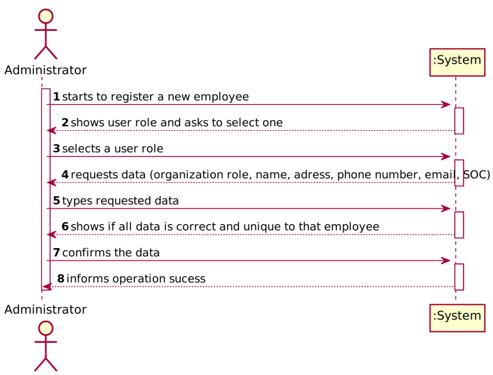
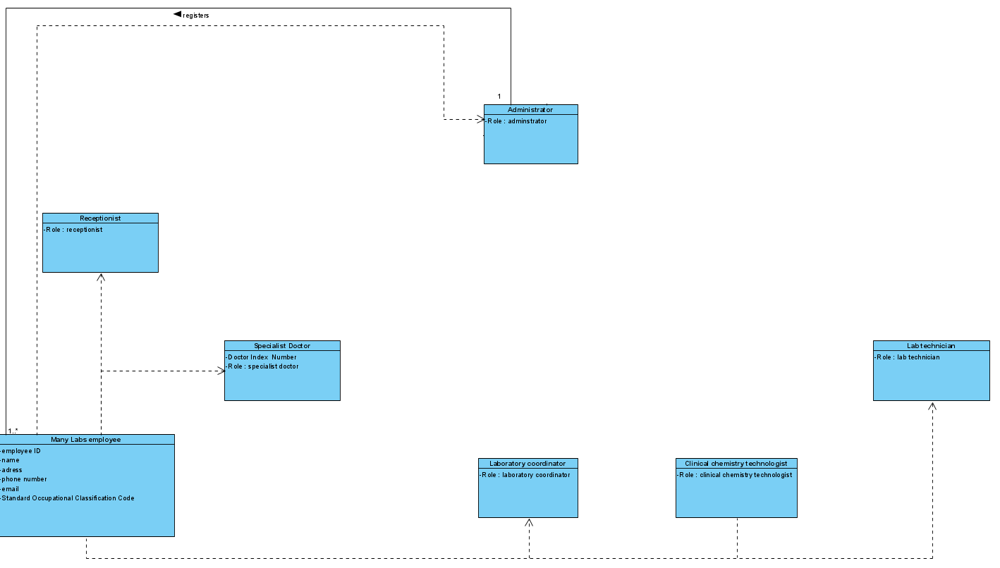
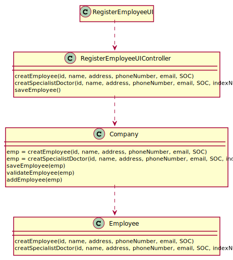

# US 007 - Register a new employee

## 1. Requirements Engineering

### 1.1. User Story Description

• US7: As an administrator, I want to register a new employee.

### 1.2. Customer Specifications and Clarifications 

**From the specifications document:**

> n/a

**From the client clarifications:**

> **Question:**  Besides the Acceptance Criteria ("each user must have a single role defined in the system"), are there other criterias we need to take into consideration ?
>  
> **Answer:** Please read the Project Requirements for Sprint B: "Each user must have a single role defined in the system. The "auth" component available on the repository must be reused (without modifications).". In my previous posts you can find other requirements that must be met in order to mark US7 as complete.

-

> **Question:** When creating a new employee, the attributes "Employee ID" and "Doctor Index Number", are implemented by the administrator or incremented by the system?
>  
> **Answer:** Only the employee ID should be generated from the initials of the employee name and should include a number. The number has 5 digits and is increases automatically when a new employee is registered in the system. For instance, if the company has 20 employees and wants to register a specialist doctor having the name Ana Maria Santos Moura, then the the employee ID for this specialist doctor should be AMSM00021.

-

> **Question:** Is there any size limit to the employee's name?
>
> **Answer:** A string with no more than 35 characters

-

> **Question:** Is there any validation that needs to be done on the employee's email format and size?
>
> **Answer:** The format of an email address is well known. Atribute validation is always a good practice.

### 1.3. Acceptance Criteria

* **AC1:** Each user must have a single role defined in the system. The "auth" component available on the repository must be reused (without modifications).
* **AC2:** The name must be a string with no more than 35 characters.
* **AC3:** The address must be a string with no more than 30 characters.
* **AC4:** The phone number must have 11 digits.
* **AC5:** SOC must have 4 digits.
* **AC6:** The index number of the Specialist Doctor must have 6 digits.

### 1.4. Found out Dependencies

* There no dependencies found

### 1.5 Input and Output Data

**Input Data:**

* Typed data:
	* organization role
	* name
	* adress
	* phone number
	* email
	* standard occupational classification (SOC)
	* index number
	

**Output Data:**

* (In)Success of the operation

### 1.6. System Sequence Diagram (SSD)

### 1.7 Other Relevant Remarks

n/a

## 2. OO Analysis

### 2.1. Relevant Domain Model Excerpt 

### 2.2. Other Remarks

n/a

## 3. Design - User Story Realization 

### 3.1. Rationale

**SSD - Alternative 1 is adopted.**

| Interaction ID | Question: Which class is responsible for... | Answer  | Justification (with patterns)  |
|:-------------  |:--------------------- |:------------|:---------------------------- |
| Step 1  		 |	... interacting with the actor? | RegisterEmployeeUI  |  
| 			  	 |	... coordinating the US? | RegisterEmployeeUIController | Controller                             |
| 			  	 | ... knowing the user using the system?  | UserSession  | IE: cf. A&A component documentation.  |
| 		 		 |							 | Company  | IE: knows/has its own Employees|
|   	  		 |							 | Employee  | IE: knows its own data (e.g. email) |
| Step 2  		 |	...saving the inputted data? | Company | IE: object created in step 1 has its own data.  | 
| Step 3  		 |	... validating all data (local validation)? | RegisterEmployeeUI| IE: owns its data.| 
| 			  		 |	... validating all data (global validation)? | Employee | IE: knows all the data.| 
| 			  		 |	... saving the created Employee? | Company | IE: owns all its employees.| 
| Step 4  		 |	... informing operation success?| RegisterEmployeeUI | IE: is responsible for user interactions.  | 

## 3.2. Sequence Diagram (SD)

## 3.3. Class Diagram (CD)

# 4. Tests 

	@Test
	public void validateRole() {
	Employee newEmployee = new Employee("Receptionist", "PS00001", "Pedro Sousa", "100 rua Egas Moniz", new Email("123@isep.pt") , "12345678911", 1234);
	newEmployee.validateRole("Receptionist");
	}

    @Test
    public void validateName() {
        Employee newEmployee = new Employee("Receptionist", "", "Pedro Sousa", "100 rua Egas Moniz", new Email("123@isep.pt") , "12345678911", 1234);
        String expresult = "Pedro Sousa";
        String result = newEmployee.getName();
        assertEquals(expresult, result);
    }

    @Test
    public void validateAddress() {
        Employee newEmployee = new Employee("Receptionist", "", "Pedro Sousa", "100 rua Egas Moniz", new Email("123@isep.pt") , "12345678911", 1234);
        String expresult = "100 Egas Moniz";
        String result = newEmployee.getAddress();
        assertEquals(expresult, result);
    }

    @Test
    public void validatePhone_Number() {
        Employee newEmployee = new Employee("Receptionist", "", "Pedro Sousa", "100 rua Egas Moniz", new Email("123@isep.pt") , "12345678911", 1234);
        String expresult = "12345678911";
        String result = newEmployee.getPhone_Number();
        assertEquals(expresult, result);
    }

    @Test
    public void validateSoc() {
        Employee newEmployee = new Employee("Receptionist", "", "Pedro Sousa", "100 rua Egas Moniz", new Email("123@isep.pt") , "12345678911", 1234);
        long expresult = 1234;
        long result = newEmployee.getSoc();
        assertEquals(expresult, result);
    }

    @Test
    public void validateIndexNumber() {
        Employee newEmployee = new Employee("Receptionist", "", "Pedro Sousa", "100 rua Egas Moniz", new Email("123@isep.pt") , "12345678911", 1234, 123456);
        long expresult = 123456;
        long result = newEmployee.getIndexNumber();
        assertEquals(expresult, result);
    }

# 5. Construction (Implementation)

## Controller

 public class RegisterEmployeeUIController {

    private Company company;
    private Employee employee;
    

    public RegisterEmployeeUIController() {
        this(App.getInstance().getCompany());
    }

    public RegisterEmployeeUIController(final Company company) {
        this.company = company;
        employee = null;
    }

    /**
     * Cria um Employee
     */
    public void creatEmployee(final String role, final String employeeID, final String name, final String address, final Email email, final String phone_Number, final long soc) {
        employee = company.creatEmployee(role, employeeID, name, address, email, phone_Number, soc);
        this.company.validateEmployee(this.employee);
    }

    /**
     * Criaa um Specialist Doctor
     */
    public void creatEmployeeSpecialistDoctor(final String role, final String employeeID, final String name, final String address, final Email email, final String phone_Number, final long soc, final long indexNumber) {
        employee = company.creatSpecialistDoctor(role, employeeID, name, address, email, phone_Number, soc, indexNumber);
        this.company.validateSpecialist(this.employee);
    }

    public boolean saveEmployee(){
        return company.saveEmployee(this.employee);
    }

 }

 ## Class Organization

public class Employee {

    /**
     * O papel do Employee.
     */
    private String role;

    /**
     * A id do Employee.
     */
    private String employeeID;

    /**
     * O nome do Employee.
     */
    private String name;

    /**
     * A morada do Employee.
     */
    private String address;

    /**
     * O email do Employee.
     */
    private Email email;

    /**
     * O número de telefone do Employee.
     */
    private String phone_Number;

    /**
     * O SOC do Employee.
     */
    private long soc;

    /**
     * O index number do Specialist Doctor.
     */
    private long indexNumber;

    /**
     * Constrói uma instância de Employee recebendo o papel, id, nome, morada, email, número de telefone e soc.
     * @param role o papel do Employee
     * @param employeeID a id do Employee
     * @param name o nome do Employee
     * @param address a morada do Employee
     * @param email o email do Employee
     * @param phone_Number o número de telefone do Employee
     * @param soc o SOC do Employee
     */
    public Employee(String role, String employeeID, String name, String address, Email email, String phone_Number, long soc) {
        validateRole(role);
        this.role = role;

        validateName(this.name);
        this.name = name;

        this.employeeID = generateID(this.name);

        validateAddress(this.address);
        this.address = address;

        validatePhone_Number(this.phone_Number);
        this.phone_Number = phone_Number;

        this.email = email;

        validateSoc(this.soc);
        this.soc = soc;
    }

    /**
     * Constrói uma instância de Employee recebendo o papel, id, nome, morada, email, número de telefone, soc e index number.
     * @param role o papel do Employee
     * @param employeeID a id do Employee
     * @param name o nome do Employee
     * @param address a morada do Employee
     * @param email o email do Employee
     * @param phone_Number o número de telefone do Employee
     * @param soc o SOC do Employee
     * @param indexNumber o index number do Specialist Doctor
     */
    public Employee(String role, String employeeID, String name, String address, Email email, String phone_Number, long soc, long indexNumber) {
        validateRole(role);
        this.role = role;

        validateName(this.name);
        this.name = name;

        this.employeeID = generateID(this.name);

        validateAddress(this.address);
        this.address = address;

        validatePhone_Number(this.phone_Number);
        this.phone_Number = phone_Number;

        this.email = email;

        validateSoc(this.soc);
        this.soc = soc;

        validateIndexNumber(this.indexNumber);
        this.indexNumber = indexNumber;
    }

    /**
     * Devolve o papel do Employee.
     *
     * @return papel do Employee
     */
    public String getRole() { return role; }
    /**
     * Modifica o papel do Employee.
     *
     * @param role o novo papel do Employee
     */
    public void setRole(String role) { this.role = role; }

    /**
     * Devolve o ID do Employee.
     *
     * @return ID do Employee
     * @param name
     */
    public String getEmployeeID(String name) { return employeeID; }
    /**
     * Modifica o ID do Employee.
     *
     * @param employeeID o novo ID do Employee
     */
    public void setEmployeeID(String employeeID) { this.employeeID = employeeID; }

    /**
     * Devolve o nome do Employee.
     *
     * @return nome do Employee
     */
    public String getName() { return name; }
    /**
     * Modifica o nome do Employee.
     *
     * @param name o novo nome do Employee
     */
    public void setName(String name) { this.name = name; }

    /**
     * Devolve a morada do Employee.
     *
     * @return morada do Employee
     */
    public String getAddress() { return address; }
    /**
     * Modifica a morada do Employee.
     *
     * @param address a nova morada do Employee
     */
    public void setAddress(String address) { this.address = address; }

    /**
     * Devolve o email do Employee.
     *
     * @return email do Employee
     */
    public Email getEmail() { return email; }
    /**
     * Modifica o email do Employee.
     *
     * @param email o novo email do Employee
     */
    public void setEmail(Email email) { this.email = email; }

    /**
     * Devolve o numero de telefone do Employee.
     *
     * @return numero de telefone do Employee
     */
    public String getPhone_Number() { return phone_Number; }
    /**
     * Modifica o numero de telefone do Employee.
     *
     * @param phone_Number o novo numero de telefone do Employee
     */
    public void setPhone_Number(String phone_Number) { this.phone_Number = phone_Number; }

    /**
     * Devolve o soc do Employee.
     *
     * @return soc do Employee
     */
    public long getSoc() { return soc; }
    /**
     * Modifica o SOC do Employee.
     *
     * @param soc o novo SOC do Employee
     */
    public void setSoc(long soc) { this.soc = soc; }

    /**
     * Devolve o index number do Employee.
     *
     * @return index number do Employee
     */
    public long getIndexNumber() { return indexNumber; }
    /**
     * Modifica o index number do Specialist Doctor.
     *
     * @param indexNumber o novo index number do Specialist Doctor
     */
    public void setIndexNumber(long indexNumber) { this.indexNumber = indexNumber; }

    /**
     * Valida o papel do Employee.
     */
    public void validateRole(String role){
        if (role.length() > 40)
            throw new IllegalArgumentException("Role cannot exceed the limit");
        if (StringUtils.isBlank(role))
            throw new IllegalArgumentException("Role cannot be blank.");
    }

    /**
     * Valida o nome do Employee.
     */
    public void validateName(String name){
        if (name.length() > 35)
            throw new IllegalArgumentException("Employee must have less than 36 characters");
        if (StringUtils.isBlank(name))
            throw new IllegalArgumentException("Employee must have a name");
    }

    /**
     * Valida a morada do Employee.
     */
    public void validateAddress(String address) {
        if (address.length() > 30)
            throw new IllegalArgumentException("Employee's address must have less than 30 characters");
        if (StringUtils.isBlank(address))
            throw new IllegalArgumentException("Employee's address must have an address");
    }

    /**
     * Valida o numero de telefone do Employee.
     */
    public void validatePhone_Number(String phone_Number) {
        if (phone_Number.length() != 11)
            throw new IllegalArgumentException("Employee's phone number must have 11 digits");
        if (StringUtils.isBlank(phone_Number))
            throw new IllegalArgumentException("Employee must have a phone number");
    }

    /**
     * Valida o soc do Employee.
     */
    public void validateSoc (long soc) {
        if (soc < 1000 || soc > 9999)
            throw new IllegalArgumentException("Employee's SOC must have 4 digits");
    }

    /**
     * Valida o index number do Employee.
     */
    public void validateIndexNumber (long indexNumber) {
        if (soc < 100000 || soc > 999999)
            throw new IllegalArgumentException("Employee's index number must have 6 digits");
    }

    /**
     * Gera o ID do Employee.
     *
     * @return employeeID do Employee
     */
    public String generateID(String name) {
        int count = 0, max = 99999;
        String empID = "";

        count++;
        count = count % max;
        String numEmp = String.valueOf(count);
        while (numEmp.length() < 6) {
            numEmp = "0" + numEmp;
        }

        String idName = getName();
        String[] id = idName.split(" ");
        for (String s : id) {
            empID = empID + String.valueOf(s.toUpperCase().charAt(0));
        }
        empID = empID + numEmp;

        return empID;
    }

    /**
     * Devolve os atributos do Employee.
     */
    @Override
    public String toString() {
        return ("role- " + role + "employee Id- " + employeeID + "name- " + name + "address- " + address + "email- " + email + "phone number- " + phone_Number + "SOC- " + soc);
    }

}

# 6. Integration and Demo 

* A new option on the Administrator menu options was added.

# 7. Observations

n/a
