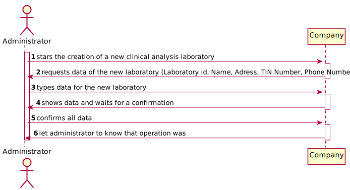
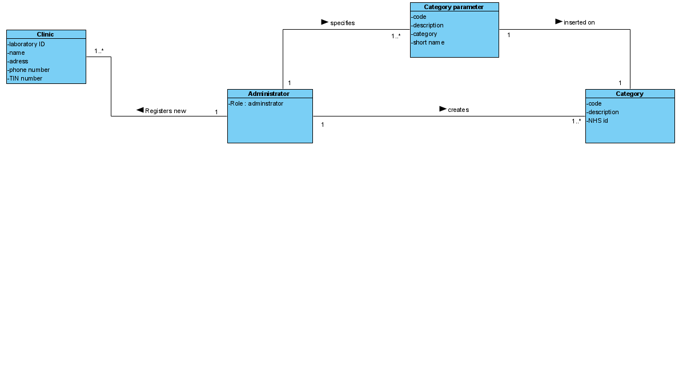
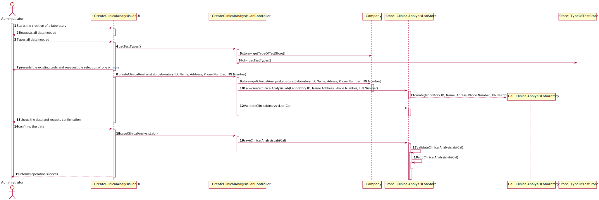
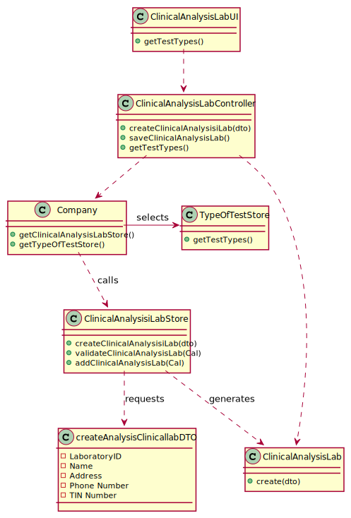

# US 008 - To register a new clinical analysis laboratory

## 1. Requirements Engineering

### 1.1. User Story Description

As an administrator, I want to register a new clinical analysis laboratory stating which
kind of test(s) it operates

### 1.2. Customer Specifications and Clarifications 

**From the specifications document:**

>	"All Many Labs clinical analysis laboratories perform clinical blood tests and a subset of these laboratories also performs Covid-19 tests."
>   "The set of Many labs clinical analysis laboratories from a network that covers all England and it is responsible for collecting samples and interacting with clients."

**From the client clarifications:**

> **Question:** Is there a maximum limit of types of tests a clinical analysis laboratory can operate?
>  
> **Answer:** No.

> **Question:** We know through the specifications document that "All Many Labs clinical analysis laboratories perform clinical blood tests".
My question therefore is: When creating a new Clinical Analysis Laboratory, should the system automatically record that it operates that type of test or should the person who is creating it select it manually while selecting other types of tests? Or other option?
>  
> **Answer:**  The administrator should select, manually, all the types of tests to be performed by the Clinical Analysis Laboratory.

> **Question:** Are the test types in US8 typed in or selected from those that the program has?
>
> **Answer:** The test types are selected from a list

> **Question:** What information is associated with a Clinical Analysis laboratory?(e.g. designation, localization...). What rules are applicable to such data? 
>
> **Answer:** Each Clinical Analysis Laboratory is characterized by the following atributes:
>  - Laboratory ID
>  - Name
>  - Address
>  - Phone Number
>  - TIN Number
>  - Type of tests performed by the lab.
>  - All information  above is required

> **Question:** Which type/format has LaboatoryID, address, name, phone number, and TIN Number on Clinical Analysis Laboratory? 
>
> **Answer:** Each Clinical Analysis Laboratory is characterized by the following atributes:
>  -  Laboratory ID: five alphanumeric characters
>  - Name: A string with no more than 20 characters
>  - Address: A string with no more than 30 characters
>  - Phone Number: 11 digit number
>  - TIN Number: 10 digit number
>  - Type of tests performed by the lab.

> **Question:** Also, should we the employees be allocated to the clinical in which they work? or, for example, can one medical lab technician work in more than one clinical analysis lab?
>
> **Answer:** Each Recepctionist and each medical lab can work in any Clinical Analysis Laboratory of the Many Labs network.

> **Question:** Is there a maximum limit of types of tests a clinical analysis laboratory can operate?
>
> **Answer:** The Administrator should select, manually, all the types of tests to be performed by the Clinical Analysis Laboratory

> **Question:** When registering a new laboratory does the administrator selects or write the type of tests performed by a Clinical Analysis Laboratory?
>
> **Answer:** Yes. In Sprint B requirements we get "US8: As an administrator, i want to register a new clinical analysis laboratory stating which kind of test(s) it operates".
### 1.3. Acceptance Criteria

* **AC1:** Laboratory ID must have five alphanumeric characters.
* **AC2:** Address must be a string with no more than 30 characters.
* **AC3:** Code must have the type of tests performed by the lab.
* **AC4:** Name must be a string with no more than 20 characters.
* **AC5:** Phone Number must be a 11 digit number.
* **AC6:** TIN Number must be a 10 digit number.

### 1.4. Found out Dependencies

* There is a dependency to US09 since, in order to create a new clinical analysis laboratory, it's needed to choose the type(s) of test(s) that will be performed (if necessary add one), and that can change from laboratory to laboratory.

### 1.5 Input and Output Data

**Input Data:**

* Typed data:
	* Laboratory ID 
	* Address
	* Name
	* Phone Number
	* TIN Number

**Output Data:**

* Test Types List
* (In)Success of the operation

### 1.6. System Sequence Diagram (SSD)

**Alternative 1**

**Other alternatives might exist.**

### 1.7 Other Relevant Remarks

* The created task stays in a "not published" state in order to distinguish from "published" tasks.

## 2. OO Analysis

### 2.1. Relevant Domain Model Excerpt 

### 2.2. Other Remarks

## 3. Design - User Story Realization 

### 3.1. Rationale

**SSD - Alternative 1 is adopted.**

| Interaction ID | Question:Which class is responsible for... | Answer  | Justification (with patterns)  |
|:-------------  |:--------------------- |:------------|:---------------------------- |
| Step 1  		 |	...starting the creation of a new clinical analysis laboratory? | Administrator  |  Pure Fabrication: there is no reason to assign this responsibility to any existing class in the Domain Model.           |
| Step 2  		 |	 |            |                              |
| Step 3  		 |	...typing data for the new laboratory? | Administrator | IE: Administator knows all data to input.  |
| Step 4  		 |	...showing data and waiting for confirmation? | Company  | |
| Step 5  		 |	...confirming data? | Adminstrator  | IE:  Administrator confirms all data  |
| Step 6  		 |	...letting know that operation was successful?| CreateClinicalAnalysisLabUI |IE: is responsible for user interactions. |
 

### Systematization ##

According to the taken rationale, the conceptual classes promoted to software classes are: 

 * Company
 * Administrator

Other software classes (i.e. Pure Fabrication) identified: 

 * CreateClinicAnalysisLabUI  
 * CreateClinicAnalysisLabController

## 3.2. Sequence Diagram (SD)

**Alternative 1**

## 3.3. Class Diagram (CD)

**From alternative 1**

# 4. Tests 

**Tests ClinicalAnalysisLaboratory:** 

    @Test
    public void validateLaboratoryID() {
        cal.validateLaboratoryID(dto);
    }

    @Test(expected = IllegalArgumentException.class)
    public void validateLaboratoryID2() {
        dto.setLaboratoryID("aaaaaaaaaaaaaaaaaaaaa");
        cal.validateLaboratoryID(dto);
    }

    @Test
    public void validateName() {
        cal.validateName(dto);
    }

    @Test(expected = IllegalArgumentException.class)
    public void validateName2() {
        dto.setName("aaaaaaaaaaaaaaaaaaaaaaaa");
        cal.validateName(dto);
    }

    @Test(expected = IllegalArgumentException.class)
    public void validateAddress() {
        dto.setAddress("aaaaaaaaaaaaaaaaaaaaaaaaaaaaaaaaaaaaaaaaaaaaaaaaaaaaaaaaaaaaaaaaaaaaaaaaaaaaaa");
        cal.validateAddress(dto);
    }

    @Test
    public void validateAddress2() {
        cal.validateAddress(dto);
    }

    @Test(expected = IllegalArgumentException.class)
    public void validatePhone_Number() {
        dto.setPhone_Number("");
        cal.validatePhone_Number(dto);
    }

    @Test
    public void validatePhone_Number2() {
        cal.validatePhone_Number(dto);
    }

    @Test(expected = IllegalArgumentException.class)
    public void validateTin_Number() {
        dto.setTin_Number("");
        cal.validateTin_Number(dto);
    }

    @Test
    public void validateTin_Number2() {
        cal.validateTin_Number(dto);
    }
}
	

**Tests ClinicalAnalysisLabStore:**

	@Test
    public void validateClinicalAnalysisLab() {
        boolean result = store.validateClinicalAnalysisLab(store.createClinicalAnalysisLab(dto));
        Assert.assertEquals(true, result);
    }

    @Test
    public void saveClinicalAnalysisLab() {
        boolean result = store.saveClinicalAnalysisLab(store.createClinicalAnalysisLab(dto));
        Assert.assertEquals(true, result);
    }
    @Test
        public void addClinicalAnalysislab () {
            boolean result = store.addClinicalAnalysisLab(store.createClinicalAnalysisLab(dto));
            Assert.assertEquals(true, result);
        }
    }@Test
    public void validateClinicalAnalysisLab() {
        boolean result = store.validateClinicalAnalysisLab(store.createClinicalAnalysisLab(dto));
        Assert.assertEquals(true, result);
    }

    @Test
    public void saveClinicalAnalysisLab() {
        boolean result = store.saveClinicalAnalysisLab(store.createClinicalAnalysisLab(dto));
        Assert.assertEquals(true, result);
    }
    @Test
        public void addClinicalAnalysislab () {
            boolean result = store.addClinicalAnalysisLab(store.createClinicalAnalysisLab(dto));
            Assert.assertEquals(true, result);
        }
    }

*It is also recommended to organize this content by subsections.* 

# 5. Construction (Implementation)

## Class CreateClinicalAnalysisLabController

		public class CreateClinicalAnalysisLabController {

    private ClinicalAnalysisLabStore store;
    private Company company;
    private ClinicalAnalysisLaboratory cal;

    /**
     *
     */
    public CreateClinicalAnalysisLabController(){
        this(App.getInstance().getCompany());
    }

    /**
     *
     * @param company
     */
    public CreateClinicalAnalysisLabController(Company company){
        this.company=company;
        this.cal=null;
    }

    /**
     * Creates Clinical Analysis Laboratory with the attributes reserved on DTO
     * @param dto
     */
    public void createClinicalAnalysisLab(CreateAnalysisClinicalLabDTO dto){
        store= company.getStore();
        cal = store.createClinicalAnalysisLab(dto);
    }

    /**
     * Method to save CLinical Analysis Lab
     */
    public void saveClinicalAnalysisLab(){
        store.saveClinicalAnalysisLab(cal);
    }
}

## Class ClinicalAnalysisLaboratory

	public class ClinicalAnalysisLaboratory {
    private String laboratoryID;
    private String name;
    private String address;
    private String phone_Number;
    private String tin_Number;
    private TesteType newTestContainer;
    private CreateAnalysisClinicalLabDTO dto;
    private int laboratoryIdDigits=5;

    /**
     * Creates a Clinical Analysis Laboratory
     * @param dto
     */
    public ClinicalAnalysisLaboratory(CreateAnalysisClinicalLabDTO dto) {
        this.laboratoryID = dto.getLaboratoryID();
        this.name = new String(dto.getName());
        this.address = new String(dto.getAddress());
        this.phone_Number = dto.getPhone_Number();
        this.tin_Number = dto.getTin_Number();
    }

    /**
     * Laboratory ID must have 5 alhpanumeric characters
     * @param dto
     */
    public void validateLaboratoryID(CreateAnalysisClinicalLabDTO dto){
        if (dto.getLaboratoryID().length() !=laboratoryIdDigits)
            throw new IllegalArgumentException("Laboratory ID must have 5 alphanumeric characters.");
    }

    /**
     * Laboratory Name must have less than 20 characters
     * @param dto
     */
    public void validateName(CreateAnalysisClinicalLabDTO dto){
        if (dto.getName().length()>20)
            throw new IllegalArgumentException("Laboratory must have less than 20 characters");
        if (dto.getName().length()<1)
            throw new IllegalArgumentException("Laboratory must have a name");
    }

    /**
     * Laboratory Address must have less than 30 characters
     * @param dto
     */
    public void validateAddress(CreateAnalysisClinicalLabDTO dto) {
        if (dto.getAddress().length() > 30)
            throw new IllegalArgumentException("Laboratory must have less than 30 characters");
        if (dto.getAddress().length() < 1)
                throw new IllegalArgumentException("Laboratory must have an address");

    }

    /**
     * Laboratory Phone Number must have 11 digits!
     * @param dto
     */

    public void validatePhone_Number(CreateAnalysisClinicalLabDTO dto){
        if (dto.getPhone_Number().length() !=11)
            throw new IllegalArgumentException("Laboratory phone number must have exactly 11 digits!");
    }

    /**
     * TIN Number must have 10 digits!
     * @param dto
     */
    public void validateTin_Number(CreateAnalysisClinicalLabDTO dto){
        if(dto.getTin_Number().length() !=10)
            throw new IllegalArgumentException("Laboratory Tin Number must have exactly 10 digits");
    }

## Class ClinicalAnalysislabStore
	public class ClinicalAnalysisLabStore implements app.domain.shared.ClinicalAnalysisLaboratories {
	private CreateAnalysisClinicalLabDTO dto;
	private ClinicalAnalysisLaboratory Cal;
	private Company company;

        public ClinicalAnalysisLaboratory createClinicalAnalysisLab(CreateAnalysisClinicalLabDTO dto) {
            return Cal = new ClinicalAnalysisLaboratory(dto);
        }

        public ClinicalAnalysisLabStore(Company company) {
            this.company=company;
        }

        public boolean validateClinicalAnalysisLab(ClinicalAnalysisLaboratory Cal) {
            if (Cal == null)
                return false;
            return true;
        }

        public boolean addClinicalAnalysisLab(ClinicalAnalysisLaboratory Cal) {
            return clinicalAnalysisLaboratories.add(Cal);
        }

        public boolean saveClinicalAnalysisLab(ClinicalAnalysisLaboratory Cal) {
            if (!(validateClinicalAnalysisLab(Cal)) || !(addClinicalAnalysisLab(Cal)))
                return false;
            return true;

        }
    }
## Class CreateAnalysisClinicalLabDTO
	public class CreateAnalysisClinicalLabDTO {
	private String laboratoryID;
	private String name;
	private String address;
	private String phone_Number;
	private String tin_Number;
	private TesteType newTestContainer;

    /**
     * DTo were data is preserved
     * @param laboratoryID
     * @param name
     * @param address
     * @param phone_Number
     * @param tin_Number
     * @param newTestContainer
     */
    public CreateAnalysisClinicalLabDTO(String laboratoryID, String name, String address, String phone_Number, String tin_Number, List<TesteType> newTestContainer) {
        this.laboratoryID = laboratoryID;
        this.name = name;
        this.address = address;
        this.phone_Number = phone_Number;
        this.tin_Number = tin_Number;
        this.newTestContainer = null;
    }

    /**
     * getter of laboatory ID
     * @return
     */
    public String getLaboratoryID() {
        return laboratoryID;
    }

    /**
     * setter of laboratory ID
     * @param laboratoryID
     */
    public void setLaboratoryID(String laboratoryID) {
        this.laboratoryID = laboratoryID;
    }

    /**
     * getter of name
     * @return
     */
    public String getName() {
        return name;
    }

    /**
     * setter of name
     * @param name
     */
    public void setName(String name) {
        this.name = name;
    }

    /**
     * getter of address
     * @return
     */
    public String getAddress() {
        return address;
    }

    /**
     * setter of address
     * @param address
     */
    public void setAddress(String address) {
        this.address = address;
    }

    /**
     * getter of Phone Number
     * @return
     */
    public String getPhone_Number() {
        return phone_Number;
    }

    /**
     * setter of Phone Number
     * @param phone_Number
     */
    public void setPhone_Number(String phone_Number) {
        this.phone_Number = phone_Number;
    }

    /**
     * getter of TIN_Number
     * @return
     */
    public String getTin_Number() {
        return tin_Number;
    }

    /**
     * setter of TIN_Number
     * @param tin_Number
     */
    public void setTin_Number(String tin_Number) {
        this.tin_Number = tin_Number;
    }

    /**
     * getter of the list with the tests
     * @return
     */
    public TesteType getNewTestContainer() {
        return newTestContainer;
    }

    /**
     * setter of the list with the tests
     * @param NewTestContainer
     */
    public void setNewTestContainer(TesteType NewTestContainer) {
        this.newTestContainer = NewTestContainer;
    }
}
# 6. Integration and Demo 

* A new option on the Employee menu options was added.

* Some demo purposes some tasks are bootstrapped while system starts.

# 7. Observations

Platform and Organization classes are getting too many responsibilities due to IE pattern and, therefore, they are becoming huge and harder to maintain. 

Is there any way to avoid this to happen?

