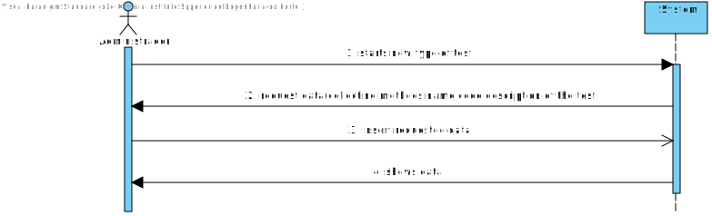
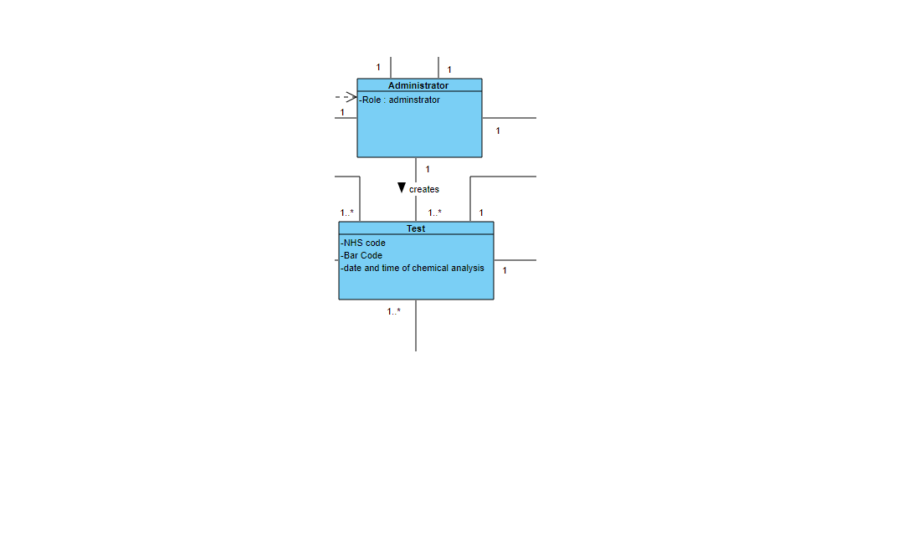
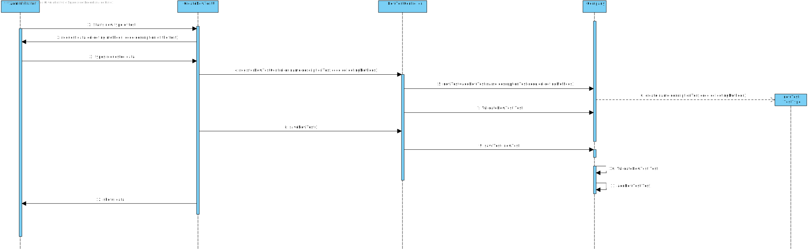

# US 009 - Specify New Test

## 1. Requirements Engineering

### 1.1. User Story Description

• US9:  As an administrator, I want to specify a new type of test and its collecting methods.
### 1.2. Customer Specifications and Clarifications 

**From the specifications document:**

"Despite being out of scope, the system should be developed having in mind the need to
easily support other kinds of tests (e.g., urine). Regardless, such tests rely on measuring one
or more parameters that can be grouped/organized by categories."

**From the client clarifications:**

> **Question:** In the US9 what do you mean by the collecting methods and  what collecting methods  are available?
>
> **Answer:** To make a Covid test you need a swab to collect a sample. To make a blood test you need sample tubes and a syringe.When the administrator (US9) specifies a new type of test, the administrator also specifies the method to collect a sample. The administrator introduces a brief description for each collecting method.

> **Question:** Analog to US8 do you have any acceptance criteria you want to introduce in US9?
>
> **Answer:**  For now I have nothing more to say about the acceptance criteria of US9.

> **Question:** Any extra feature you would like while creating a test type?
>
> **Answer:**  No, I just want the features mentioned in my previous posts.

> **Question:** Are there any different collecting methods other than the ones currently known? Which ones?
>
> **Answer:** Each collecting method is associated with a test type. Whenever a test type is created a collecting method should be defined.

> **Question:** Does a type of test holds any attribute besides it's name and collecting methods?
>
> **Answer:**  The attributes for a new test type are:
Code: five alphanumeric characters. The code is not automatically generated.
Description: a string with no more than 15 characters.
Collecting Method: a string with no more than 20 characters.
Each test type should have a set of categories. Each category should be chosen from a list of categories.
From a previous post: "Each category has a name and a unique code. There are no subcategories."There exists only one collection method per test type.

> **Question:** Are the collecting methods stored simpled as a word or a sentence, or does it also must contain it's description, and/or another attributes?
>
> **Answer:**  From a previous post: "To make a Covid test you need a swab to collect a sample. To make a blood test you need sample tubes and a syringe.
When the administrator (US9) specifies a new type of test, the administrator also specifies the method to collect a sample. The administrator introduces a brief description for specifying the collecting method. "There exists only one collection method per test type.

> **Question**: You have said in a previous post that each category has a name and an unique code. What specifies each of those? How many characters composes a name and a code for a test type category, for example?
>
>**Answer**: The format of the attributes of one category are:
Name: is a string with no more than 10 characters;
Code: are five alphanumeric characters. The code is unique and is not automatically generated.
Both attributes are mandatory.
There are no subcategories.

>**Question**: Previously you said that "When the administrator (US9) specifies a new type of test, the administrator also specifies the method to collect a sample." After the administrator creates a new type of test, does he have a list with the existing collection methods in order to, posteriorly select one of them, or does he creates this collection method at the moment?
>
>**Answer**: From a previous post: "When the administrator (US9) specifies a new type of test, the administrator also specifies the method to collect a sample. The administrator introduces a brief description for the collecting method".

### 1.3. Acceptance Criteria
* **AC1:** The code of the test must be 5 alphanumeric characters.
* **AC2:** The description of the test must be a string with no more than 15 characters.
* **AC3:** The colecting method must be a string with no more than 20 characters.

### 1.4. Found out Dependencies

* There is a dependency to US10, because in order to create the new test we need to acess the parameter categories that will be needed for the test

### 1.5 Input and Output Data

**Input Data:**

* Typed data:
	* Test type
	* Collecting methods
	* Code
	* Description of the test
	* Description of the collecting method
	
* Selected data:
	* Classifying task category 

**Output Data:**

* 
* (In)Success of the operation

### 1.6. System Sequence Diagram (SSD)

### 1.7 Other Relevant Remarks

## 2. OO Analysis

### 2.1. Relevant Domain Model Excerpt 

### 2.2. Other Remarks

n/a

## 3. Design - User Story Realization 

### 3.1. Rationale

**SSD - Alternative 1 is adopted.**

| Interaction ID | Question: Which class is responsible for... | Answer  | Justification (with patterns)  |
|:-------------  |:--------------------- |:------------|:---------------------------- |
| Step 1:   		 |	instantiating a new type of test  |  Administrator |  Pure Fabrication: there is no reason to assign this responsibility to any existing class in the Domain Model.           |	  		
| Step 2: 		 |	requesting the data?						 |  CreateNewTestUI           |                              |
| Step 3:  		 |	typing the requested data? | Administrator | IE: object created in step 1 has its own data.  |
| Step 4: 		 |	showing the data  | CreateNewTestUI  | IE: Task Categories are defined by the Platform. |
|

### Systematization ##

According to the taken rationale, the conceptual classes promoted to software classes are: 

 * Company
 * Admnistrator

Other software classes (i.e. Pure Fabrication) identified: 

 * CreateNewTestUI  
 * CreateNewTestController

## 3.2. Sequence Diagram (SD)

**Alternative 1**

# 4. Tests 

public class TesteTypeTest {
    TesteType newTest1 = new TesteType("blood", "piggie", 12345, "swab");

    
  @Test  public void validateCollectingMethods() {

        TesteType newTest = new TesteType("blood", "piggie", 12345, "swab");
        String expresult = "swab";
        String result = newTest.getCollectingMethods();
        assertEquals(expresult, result);
    }

@Test (expected = IllegalArgumentException.class)
    public void validateCollectingMethods2(){
    newTest1.validateCollectingMethods("dododdodododododoododododododod");
    }

    
  @Test  public void validateName(){
        TesteType newTest= new TesteType("blood", "piggie", 12345, "swab");
        String espressresult= "blood";
        String result= newTest.getName();
        assertEquals(espressresult,result);
    }

    @Test (expected = IllegalArgumentException.class)
    public void validateName2(){
        newTest1.validateName("ndsanasdnsansdanansdnsad");
    }

   
   @Test public void validateDescriptionTest(){
        TesteType newTest= new TesteType("blood", "piggie", 12345, "swab");
        String expecresult= "piggie";
        String result= newTest.getDescriptionTest();
        assertEquals(expecresult,result);
    }
@Test (expected = IllegalArgumentException.class)
    public void validateDescriptionTest2(){
    newTest1.validateDescriptionOfTheTest("buggggggggggggggggaaaaaaaaaaaaaaaaaaaaaaaaaaaaabug");

}
@Test
    public void validateCode(){
        TesteType newTest= new TesteType("blood", "piggie", 12345, "swab");
        int expecreuslt=12345;
        int result= newTest.getCode();
        assertEquals(expecreuslt,result);
}
@Test(expected = IllegalArgumentException.class)
    public void validateCode2(){
    newTest1.validateCode(1234567);
}

}

# 5. Construction (Implementation)

## Class NewTestController 

<<<<<<< Updated upstream
<<<<<<< Updated upstream
package app.controller;
import app.domain.model.Company;

import app.domain.model.ParameterCategory;
import app.domain.model.TesteType;

import java.util.ArrayList;
import java.util.List;

public class NewTestController {

    private  TesteType newTest;
    private  Company company;

    //List<ParameterCategory> listacategorias = new ArrayList<ParameterCategory>();
    /**
     calls company method to add a new test
     @return test if sucessfuly validated
     */
    public TesteType registerNewTestController(String name, String descriptionTest, int code, String collectingMethods){
       return newTest=this.company.addNewTest(collectingMethods,descriptionTest,code,name);

    }

    public NewTestController(){
        this(App.getInstance().getCompany());
    }

    public NewTestController(Company company){
        this.company=company;
        this.newTest=null;
    }

    public boolean registerNewTest(String name, String descriptionTest, int code, String collectingMethods){
this.newTest=this.company.addNewTest(name,descriptionTest,code,collectingMethods);

return this.company.validateNewTest(newTest);

    }

    /**
     calls company method to save a test
     */
    public boolean saveNewTest(){
       return this.company.saveNewTest(newTest);
    }
public List<TesteType> getNewTestContainer(){
        return company.getNewTestContainer();
}

    public List<ParameterCategory> getParamterCategoryList(){
        return company.getParameterCategoryList();
    }

=======
=======
>>>>>>> Stashed changes
	package app.controller;
    import app.domain.model.Company;
    
    import app.domain.model.TesteType;
    import auth.AuthFacade;
    
    import java.util.ArrayList;
    import java.util.List;
    
    public class NewTestController {
    
        private  TesteType newTest;
        private  Company company;
        private List<TesteType> newTestContainer= new ArrayList<TesteType>();
    
        /**
         calls company method to add a new test
         @return test if sucessfuly validated
         */
        public boolean registerNewTestController(String name, String descriptionTest, int code, String collectingMethods){
            this.newTest=this.company.addNewTest(collectingMethods,descriptionTest,code,name);
            return this.company.validateNewTest(newTest);
        }
    
        public NewTestController(){
            this(App.getInstance().getCompany());
        }
    
        public NewTestController(Company company){
            this.company=company;
            this.newTest=null;
        }
    
    
    
        /**
         calls company method to save a test
         */
        public void saveNewTest(String name, String descriptionTest, int code, String collectingMethods){
            company.saveNewTest(newTest);
        }
    
    }
<<<<<<< Updated upstream
>>>>>>> Stashed changes
=======
>>>>>>> Stashed changes

## Class TestType

	package app.domain.model;
    
    import org.apache.commons.lang3.StringUtils;
    
    public class TesteType {
    
    
            private String collectingMethods;
            private int code;
            private String descriptionTest;
            private String name;
    
    
        /**
         * Constroy an instance  of TestType receiving  name, descriptionTest , code e collectingMethods
         *
         * @param name the name of the test
         * @param  descriptionTest the discrption of the test
         * @param  code the code of the test
         * @param  collectingMethods collecting method
         */
    
        public TesteType(String name, String descriptionTest , int code, String collectingMethods) {
                validateCode(code);
                validateCollectingMethods(collectingMethods);
                validateDescriptionOfTheTest(descriptionTest);
                validateName(name);
            }
    
    /**
    
     @return collecting method
     */
            public String getCollectingMethods() {
            return collectingMethods;
        }
        /**
         @return code
         */
        public int getCode() {
            return code;
        }
    
    
    
    
    
        /**
    
         @return test description
         */
        public String getDescriptionTest() {
            return descriptionTest;
        }
        /**
    
         @return test name
         */
        public String getName() {
            return name;
        }
    
    
    
    
        /**
        validate collecting method, if the validation is successful change the collecting method
    @param collectingMethods new collecting method
         */
    
        public final void validateCollectingMethods(String collectingMethods) {
                if (StringUtils.isBlank(collectingMethods) || collectingMethods.trim().isEmpty() || collectingMethods.trim().length() > 20) {
                    throw new IllegalArgumentException("Collecting Methods, please insert a name with less than 20 characters");
                }
                this.collectingMethods=collectingMethods;
           }
        /**
         validate code, if the validation is successful change the code
         @param code new code
         */
            public final void validateCode(int code) {
                if (code<10000||code>99999) {
                    throw new IllegalArgumentException("Invalid code, please use a code with 5 numbers");
    
                }
                this.code=code;
            }
            /**
         validate descriptionTest, if the validation is successful change the description of the test
         @param descriptionTest new description test
         */
        public final void validateDescriptionOfTheTest(String descriptionTest){
            if(StringUtils.isBlank(descriptionTest) || descriptionTest.trim().isEmpty() || descriptionTest.trim().length() > 15) {
                throw new IllegalArgumentException("Invalid description, please use a description with  15 characters or less");
            }
            this.descriptionTest=descriptionTest;
           }
    
        /**
         validate name, if the validation is successful change the name
         @param name new name
         */
           public final void validateName(String name){
            if(StringUtils.isBlank(name)|| name.trim().isEmpty()|| name.trim().length()>10){
                throw new IllegalArgumentException("Invalid name, please use a name with 10 characters or less");
            }
            this.name=name;
    }
    
    /**
     method that decides how will the test information bew showed
    */
    @Override
        public String toString(){
            return String.format("%s-name s% -CollectingMethods %s -DescriptionTest %s-Code",name,collectingMethods,descriptionTest,code);
    }
    
        }
    
    

# 6. Integration and Demo 

* A new option on the Admin menu was added;

# 7. Observations

