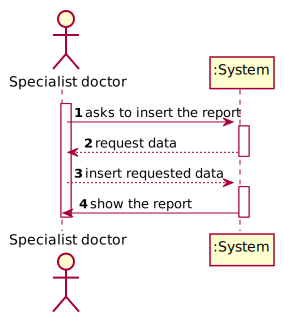
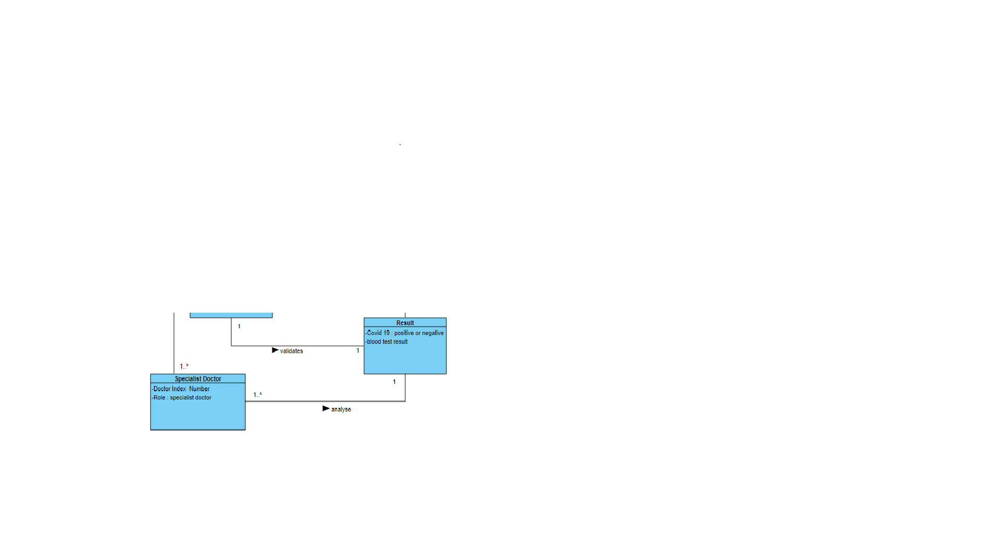
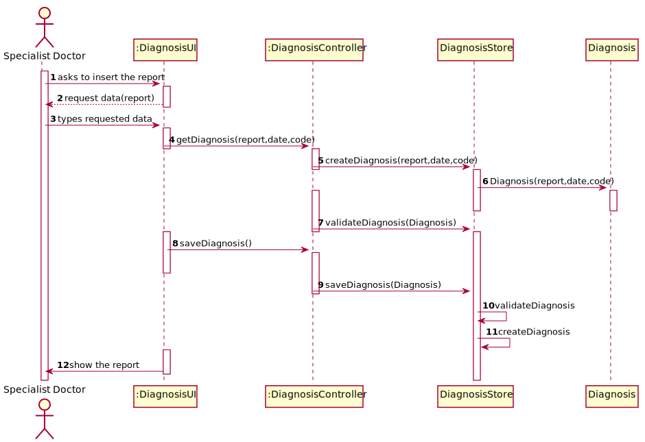

# US 014- Make the diagnosis and write a report for a given test

## 1. Requirements Engineering

### 1.1. User Story Description

•As a specialist doctor, I intend to make the diagnosis and write a report for a
 given test.

### 1.2. Customer Specifications and Clarifications 

**From the specifications document:**

After completing the chemical analysis, the results of all chemical analyses are analysed by a
specialist doctor who makes a diagnosis and writes a report that afterwards will be delivered to the
client.

To facilitate and simplify the validation work performed by the specialist doctor, the application
uses an external module that is responsible for doing an automatic validation using test reference
values. 

**From the client clarifications:**

> **Question:** What characterizes a diagnosis? What it needs to have in it to be a valid diagnosis?
>
> **Answer:** The report contains the diagnosis. The report is free text and should have no more than 400 words. 

> **Question:** Can the Specialist Doctor edit a report once it has already been written? If yes, in what occasion should he be able to edit? Can he edit after the Laboratory Coordinator has already approved the report?
>
> **Answer:** No. No.

> **Question:** Regarding the tests that the Specialist Doctor can write a report about. Should the SD chose from a list of tests? and Should him only receive a list of test that have completed all the previous steps?
>
> **Answer:** The system shows all tests ready (that have completed all the previous steps) to make the diagnosys and the Specialist Doctor selects one test. Then, the Specialist Doctor writes the report for the selected test.

> **Question:**  When the report becomes available in the system, should the system inform that the operation was successful?
>
> **Answer:** Please check the Project Description document.

>**Question:** How will the specialist doctor's report be delivered to the client? Through an email per example? If it is the case how will the email be delivered? Through an email API or written to a file?
>
>**Answer:** Where did you read that the client receives the results? From the Project Description: " [The Client] must access the
             application to view those results".
>
### 1.3. Acceptance Criteria
* **AC1:** The diagnosis should be 400 words at most.

### 1.4. Found out Dependencies

* There is a dependency to US12, because in order to make the diagnosis and write a report the specialist doctor needs the results of the test.

### 1.5 Input and Output Data

**Input Data:**

* Typed data:
	*report
	

**Output Data:**

* Report information

### 1.6. System Sequence Diagram (SSD)

### 1.7 Other Relevant Remarks

## 2. OO Analysis

### 2.1. Relevant Domain Model Excerpt 

### 2.2. Other Remarks

n/a

## 3. Design - User Story Realization 

### 3.1. Rationale

**SSD - Alternative 1 is adopted.**

| Interaction ID | Question: Which class is responsible for... | Answer  | Justification (with patterns)  |
|:-------------  |:--------------------- |:------------|:---------------------------- |
| Step 1:   		 |	instantiating a new diagnosis  |  Specialist Doctor |  Pure Fabrication: there is no reason to assign this responsibility to any existing class in the Domain Model.           |	  		
| Step 2: 		 |	requesting the data?						 |  DiagnosisUI           |                              |
| Step 3:  		 |	typing the requested data? | Specialist Doctor | IE: object created in step 1 has its own data.  |
| Step 4: 		 |	showing the data  | DiagnosisUI  | IE: Task Categories are defined by the Platform. |
|

### Systematization ##

According to the taken rationale, the conceptual classes promoted to software classes are: 

 * Company
 * Specialist Doctor

Other software classes (i.e. Pure Fabrication) identified: 

 * DiagnosisUI  
 * DiagnosisController

## 3.2. Sequence Diagram (SD)

**Alternative 1**

# 4. Tests 

    @Test
    public void validateReport() {

Diagnosis newDiagnosis = new Diagnosis("o teste foi efetuado corretamente");
   String expectresult="o teste foi efetuado corretamente";
String result=newDiagnosis.getReport();
        assertEquals(expectresult,result);
    }

    @Test
    public void getReport() {
    String report= "bom teste";
    String result=Diagnosis2.getReport();
    assertEquals(report,result);
    }
}

# 5. Construction (Implementation)

## Class DiagnosisController 

	public class DiagnosisController {
        private final Company company;
    private Diagnosis diagnosis;
        private final DiagnosisStore store = new DiagnosisStore() ;
    
    
    public DiagnosisController(){
        this(App.getInstance().getCompany());
    }
    public DiagnosisController(Company company){
        this.company=company;
    this.diagnosis=null;
        }
    
      public boolean getDiagnosis(String report){
            this.diagnosis=this.store.createDiagnosis(report);
            return this.store.validateDiagnosis(diagnosis);
    
      }
    public boolean saveDiagnosis(){
        return this.store.saveDiagnosis(diagnosis);
    }
    public List<Diagnosis> getDiagnosisList(){
    return store.getDiagnosisList();
    }
    public List<Long> getDateList(){
    return store.getDateList();
    }
    
    }

## Class Diagnosis

package app.domain.model;

import java.util.Objects;

public class Diagnosis {
    private static String report;

    public Diagnosis(String report) {
        validateReport(report);
        this.report = report;

    }

    public static String getReport() {
        return report;
    }

    public final String[] countWords() {

        String x = getReport();
        if (x == null) {
            return null;
        }
        String y[] = x.split(" ");

        return y;
    }

    public final void validateReport(String report) {
        String numberwords[] = countWords();
        if (numberwords == null) {
            return;
        }
        if (numberwords.length > 15) {
            throw new IllegalArgumentException("Invalid report, please insert a report with less than 400 words");
        }
    }

    @Override
  public String toString() {
        return String.format("report-%s", report);
    }

# 6. Integration and Demo 

* A new option on the Specialist Doctor menu was added;

# 7. Observations

