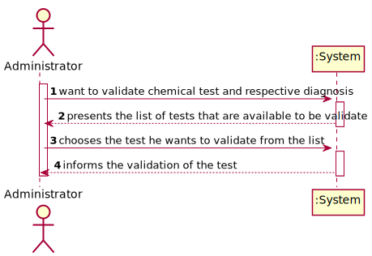
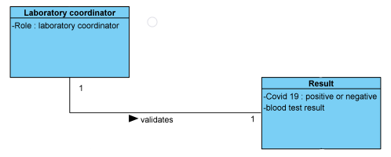
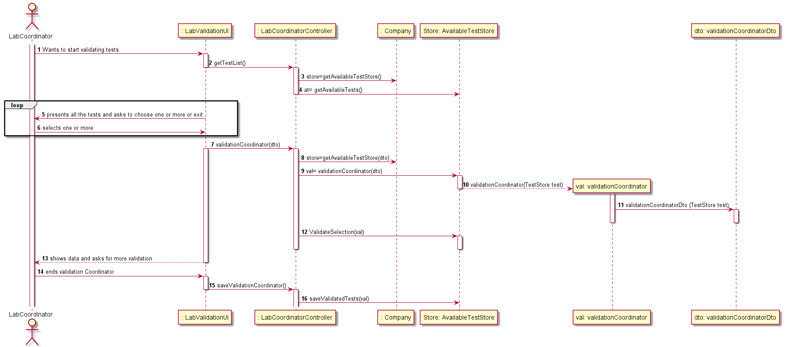
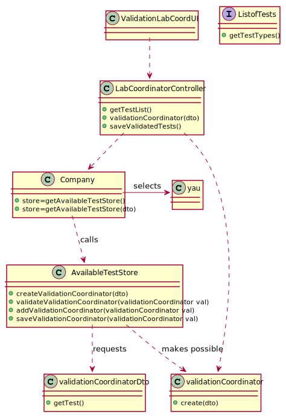

# US 015 - As a laboratory coordinator, i want to validate the work done by the clinical chemistry technologist and specialist doctor

## 1. Requirements Engineering

### 1.1. User Story Description

As a laboratory coordinator, i want to validate the work done by the clinical chemistry technologist and specialist doctor

### 1.2. Customer Specifications and Clarifications

**From the specifications document:**

> After the specialist doctor has completed the diagnosis, the results of the clinical analyses and the
report become available in the system and must be validated by the laboratory coordinator. To
validate the work done, the laboratory coordinator checks the chemical test/result and associated
diagnosis made and confirms that everything was done correctly. Once the laboratory coordinator
confirms that everything was done correctly, the client receives a notification alerting that the
results are already available in the central application and informing that he/she must access the
application to view those results. The client receives the notification by SMS and e-mail.

**From the client clarifications:**

> **Question:**  When the laboratory coordinator wants to validate a test does all the tests available show up for him or does he search using a code that identifies a specific test?
>
> **Answer:**  The system shows all tests ready to validate (tests that already have the test registration date, the chemical analysys date and the diagnosis date registered in the system) and the laboratory coordinator selects one or more tests to mark as validated.

> **Question:** What should happen to a test if either the test report or the results are invalid? Should we prompt for a redo of either process or simply erase the test?
>
> **Answer:** The laboratory coordinator only sees the test dates of tests that already have all dates registered in the system (test registration date, the chemical analysys date and the diagnosis date).

> **Question:** Should the laboratory coordinator validate the test results one by one or should he do only one validation of all of them?
>
> **Answer:** The coordinator can validate all or a subset of test results. The system does not show client personal information but shows all dates (test registration date, chemical analysys date and diagnosis date).

> **Question:** What should happen to a test if either the test report or the results are invalid? Should we prompt for a redo of either process or simply erase the test?
>
> **Answer:** The laboratory coordinator only sees the test dates of tests that already have all dates registered in the system (test registration date, the chemical analysys date and the diagnosis date).

> **Question:** Regarding the process of validating a certain test/result, what validation states should be considered by the laboratory coordinator?
For example, can "Valid" or "Invalid" be accepted as a confirmation for the chemical test/result and its diagnosis?
>
> **Answer:** Only Valid state. The system shows all tests ready to validate (tests that already have the test registration date, the chemical analysys date and the diagnosis date registered in the system) and the laboratory coordinator selects one or more tests to mark as validated.

> **Question:** Does the laboratory coordinator choose which client's results to validate?
>
> **Answer:** The laboratory coordinator chooses a set of tests he wants to validate.

>**Question:** Does the notification sent to client informing them that they have their results on the central application get sent automatically after the laboratory coordinator confirms the clinical chemistry technologist and specialist doctor's work?
>
> **Answer:** From the Project Description: "Once the laboratory coordinator confirms that everything was done correctly, the client receives a notification alerting that the results are already available in the central application and informing that he/she must access the application to view those results."

>**Question:** How should the laboratory coordinator choose the test to operate on, from a list of all the tests with a result and report or by inputting the code unique to a specific test?
>
> **Answer:**  From a list of all tests that have a test registration date, a chemical analysis date and a diagnosis date.

>**Question:** Regarding to US 15, what information does the laboratory coordinator needs to be able do validate a test? We got from the description that it's suposed to show all dates. Should the system provide any more information?
>
> **Answer:**  Only the dates. Moreover, the system should record the validation date.

>**Question:** To validate a test the laboratory coordinator should validate all the test results and the test report in that specific order?
>
> **Answer:**  Please read carefully my answers! The laboratory coordinator only sees dates of each test.

>**Question:** As soon as a test is validated should the system send the notification to a txt file like in sprint B?
>
> **Answer:** Please read carefully my answers!
In the Project Description we get: "Once the laboratory coordinator
confirms that everything was done correctly, the client receives a notification alerting that the
results are already available in the central application and informing that he/she must access the
application to view those results. The client receives the notification by SMS and e-mail. "
In a previous post in this forum:
"During the development of the Integrative Project we will not use any e-mail or SMS API services to send messages. All the e-mail and SMS messages should be written to a file with the name emailAndSMSMessages.txt. This file simulates the use of e-mail and SMS API services. "

### 1.3. Acceptance Criteria

* **AC1:** An test to be available for validation must have test registration date, a chemical analysis date and a diagnosis date.
* **AC2:** No personal data should be shown

### 1.4. Found out Dependencies

* There are dependencies with US4, US12 and US14 since the date of each state of the test has a date that is needed in order to validate.

### 1.5 Input and Output Data

**Input Data:**

* Typed data:
    * There's no typed data

* Selected data:
    *  Each test is selected to be validate

**Output Data:**

* An txt file were the client is notificated, when the test is available for consult.
* (In)Success of the operation

### 1.6. System Sequence Diagram (SSD)

**Alternative 1**

**Other alternatives might exist.**

### 1.7 Other Relevant Remarks

## 2. OO Analysis

### 2.1. Relevant Domain Model Excerpt

### 2.2. Other Remarks

n/a

## 3. Design - User Story Realization

### 3.1. Rationale

**SSD - Alternative 1 is adopted.**

| Interaction ID | Question: Which class is responsible for... | Answer  | Justification (with patterns)  |
|:-------------  |:--------------------- |:------------|:---------------------------- |
| Step 1  		 |	... interacting with the actor? | LabCoordinatorUI   |  Pure Fabrication: there is no reason to assign this responsibility to any existing class in the Domain Model.           |
| 			  		 |	... coordinating the US? | LabCoordinatorController | Controller                             |	
| Step 2  		 |						 |             |                              |
| Step 3  		 |	...present the available tests | LabValidationUI  |  |
| Step 4  		 |	...validating all the selected tests?| ValidationCoordinator  | IE: Task Categories are defined by the Platform. |
| Step 5  		 |	...sending a notification to the client| LabValidationUI  |  knows all its tasks.|

### Systematization ##

According to the taken rationale, the conceptual classes promoted to software classes are:

* AvailableTestStore
* ValidationCoordinator
* LabCoordinatorController

Other software classes (i.e. Pure Fabrication) identified:

* LabCoordinatorUI
* LabValidationUI

## 3.2. Sequence Diagram (SD)

**Alternative 1**

## 3.3. Class Diagram (CD)

**From alternative 1**

# 4. Tests

**Test 1:** 

    @Test
    public void validateTest() {
        Assert.assertTrue(store.validateTest(test));
    }
	}

*It is also recommended to organize this content by subsections.*

# 5. Construction (Implementation)

## Class LabCoordinatorController

    public List<ValidationCoordinator> createValidationCoordinator(List<validationCoordinatorDto> valDtoList){
        store=company.getAvailableTestStore(company);
        for (validationCoordinatorDto dto : valDtoList){
            ValidationCoordinator val=store.createValidationCoordinator(dto);
            store.validateValidationCoordinator(val);
            checkList.add(val);
        }
        return checkList;
    }

## Class ValidationCoordinator

    public ValidationCoordinator(TestStore test) {
        validateTest(test);
        this.test = test;
    }

# 6. Integration and Demo

* A new option on the Employee menu options was added.

* Some demo purposes some tasks are bootstrapped while system starts.

# 7. Observations

Platform and Organization classes are getting too many responsibilities due to IE pattern and, therefore, they are becoming huge and harder to maintain.

Is there any way to avoid this to happen?

