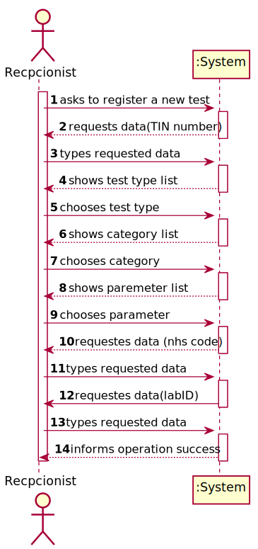
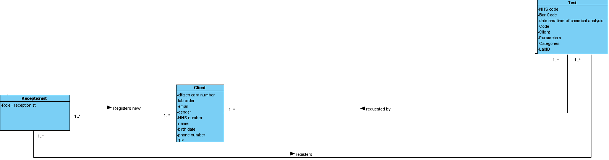
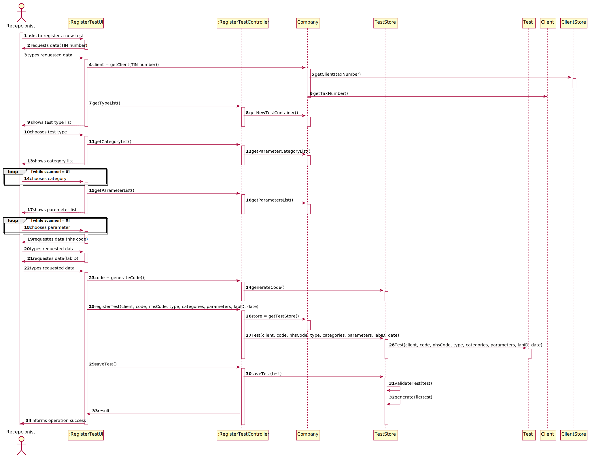
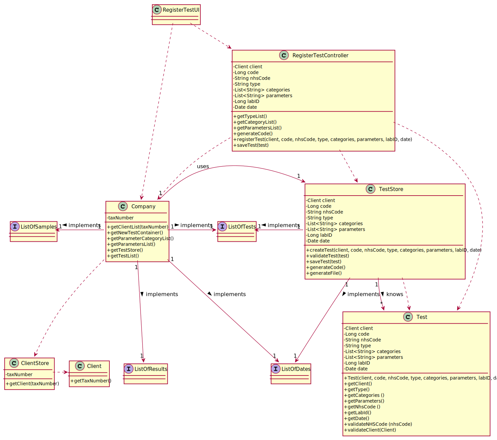

# US 003 - To register a test to be performed by a registered client.

## 1. Requirements Engineering

### 1.1. User Story Description

• As a receptionist of the laboratory, I intend to register a test to be performed to a
registered client.

### 1.2. Customer Specifications and Clarifications 

**From the specifications document:**

>	Typically, the client arrives at one of the clinical analysis laboratories with a lab order prescribed by
a doctor. Once there, a receptionist asks the client’s citizen card number, the lab order (which
contains the type of test and parameters to be measured), and registers in the application the test to
be performed to that client.

**From the client clarifications:**

> **Question:** When the receptionist is registering a test for a client, the test can have more than one category and many parameters of the chosen categories or it only can have one category?
>  
> **Answer:** Each test can have more than one category.

-

> **Question:** On the project description it says "Each test is characterized by an internal code, an NHS code, a description that identifies the sample collection method...". You said that the code is a 12 digit sequential number. Does this mean that, for example, the first test will have the code "000000000001" and so on?
>
> **Answer:** Yes.

-

> **Question:**  On the project description we have multiple attributes of date and time ("date and time when the samples were collected", etc). Are these attributes filled by the author of the respective act or is it generated by the system when those acts are performed?
>
> **Answer:** The system should automatically generate the date and time of the event (test registration, chemical analysis, diagnosis and validation).

-

> **Question:** I wanted to ask if the NHS code of which test is unique or not.
>
> **Answer:** Yes.

-

> **Question:** Since the Client has a Lab Order which contains the type of test and all the parameters to be measured, all the parameters selected by the Receptionist need to be equal to the Lab Order's parameters?
>
> **Answer:** Yes.

-

> **Question:** Other than the attributes already mentioned (test code, NHS code, designation) are there any other attributes that characterize a test?
>
> **Answer:** The test attributes are:
              Test code : Sequential number with 12 digits. The code is automatically generated.
              NHS code: 12 alphanumeric characters.

-

> **Question:** How is it possible to know in which laboratory the test is being registered? Should the Receptionist select the Laboratory before selecting the Test Type?
>
> **Answer:** After login the receptionist should select the laboratory where she is working. Then, the receptionist has access to the system's features/functionalities.

-

> **Question:** After login the receptionist should select the laboratory where she is working. Shouldn't the receptionist locate the Client by the Citizen Card Number instead of TIN Number?
>
> **Answer:** The receptionist should use the TIN number to find the client.

-

> **Question:** Can the client have two identical tests? or the system should stop from creating the same test?
>
> **Answer:** A test is unique in the system.

### 1.3. Acceptance Criteria

* **AC1:**  The receptionist must select the parameters to be analysed from
  all possible parameters in accordance with the test type.
* **AC2:** The test code is a sequential number with 12 digits and is automatically generated.
* **AC3:** The NHS number has 12 alphanumeric characters and must be unique to every test.
* **AC4:** The parameters chosen by the Receptionist must be equal to the ones in the Lab Order.
* **AC5:** The time of the test registration must be generated by the client.
* **AC6:** A test is unique in the system. 

### 1.4. Found out Dependencies

* There were no dependencies found.

### 1.5 Input and Output Data

**Input Data:**

* Typed data:
	* Tax Identification Number;
    * Test Type;
    * Categories;
    * Parameters; 
    * NHS Code;
    * Laboratory ID;
    
* Selected data:
	* n/a 

**Output Data:**

* (In)Success of the operation

### 1.6. System Sequence Diagram (SSD)

**Alternative 1**

**Other alternatives might exist.**

### 1.7 Other Relevant Remarks

* .

## 2. OO Analysis

### 2.1. Relevant Domain Model Excerpt 

### 2.2. Other Remarks

n/a

## 3. Design - User Story Realization 

### 3.1. Rationale

**SSD - Alternative 1 is adopted.**

| Interaction ID | Question: Which class is responsible for... | Answer  | Justification (with patterns)  |
|:-------------  |:--------------------- |:------------|:---------------------------- |
| Step 1  		 |	... interacting with the actor? | RegisterTestUI   |  Pure Fabrication: there is no reason to assign this responsibility to any existing class in the Domain Model.           |
| 			  		 |	... coordinating the US? | RegisterTestController | Controller                             |
| Step 2  		 |							 |             |                              |
| Step 3  		 |	...saving the inputted data? | Client | IE: Client knows its data.  |
| Step 4  		 | ...show teste type list?	 | Company | IE: knows all test types.                         |              
| Step 5  		 | |  | |  
| Step 6  		 |	... show category list ?| Company | IE: knows all categories.  |  
| Step 7  		 |	|   |  | 
| Step 8  		 |	...show parameter list?| Company  |  IE: knows all parameters.| 
| Step 9  | ...save inputed data? | Test | IE: owns its data. |
| Step 10 | | | |
| Step 11 		 |	...save the inputted data? | Test  | IE: owns its data. |
| Step 12| | | |
|   Step 13		    | ...validating all data(local validation)?| Test  | IE: an object knows its data. | 
|  		        | ...validating all data (global validation)?	| TestStore  | IE: knows all Tests. | 
| Step 14  		 | ...informing operation success?	| RegisterTestUI  | IE: is responsible for user interactions.  | 

### Systematization ##

According to the taken rationale, the conceptual classes promoted to software classes are: 

 * Test
 

Other software classes (i.e. Pure Fabrication) identified: 

 * TestStore
 * RegisterTestUI
 * RegisterTestController

## 3.2. Sequence Diagram (SD)

**Alternative 1**

## 3.3. Class Diagram (CD)

**From alternative 1**

# 4. Tests 

@Test
public void getClient() {
assertEquals(cliente, teste.getClient());
}

    @Test
    public void getType() {
        assertEquals("Covid", teste.getType());
    }

    @Test
    public void getCategories() {
        assertEquals(new ArrayList<>(), teste.getCategories());
    }

    @Test
    public void getParameters() {
        assertEquals(new ArrayList<>(), teste.getParameters());
    }

    @Test
    public void getNhsCode() {
        assertEquals("123456789123", teste.getNhsCode());
    }

    @Test
    public void getCode() {
        assertEquals(123L, teste.getCode());
    }

    @Test
    public void getLabId() {
        assertEquals(12345L, teste.getLabId());
    }

    @Test
    public void getDate() {assertEquals(new Date(), teste.getDate());}

    @Test
    public void validateNHSCode() {
        teste.validateNHSCode(teste.getNhsCode());
    }

    @Test (expected = IllegalArgumentException.class)
    public void validateNHSCodeWrong() {
        app.domain.model.Test test2 = new app.domain.model.Test(cliente, 123L, "123456789123sdfsdfsfds", "Covid", new ArrayList<>(), new ArrayList<>(), 12345L, new Date());
        test2.validateNHSCode(test2.getNhsCode());
    }

*It is also recommended to organize this content by subsections.* 

# 5. Construction (Implementation)

## Class RegisterTestController 

		package app.controller;

    import app.domain.Store.ClientStore;
    import app.domain.Store.TestStore;
    import app.domain.model.*;

    import java.util.ArrayList;
    import java.util.Date;
    import java.util.List;

    public class RegisterTestController {
    /**
    * variable from calls Client.
    */
    private Client client;

        /**
         * variable from class Company.
         */
        private Company company;

        /**
         * variable from class ClientStore.
         */
        private ClientStore store = new ClientStore();

        /**
         *variable from class TestStore.
         */
        private TestStore storeTest = new TestStore();

        /**
         * variable from class Test
         */
        private Test test;

        /**
         * List from class Client.
         */
        private List<Client> clientList = store.getClientList();

        /**
         * RegisterTestController constructor.
         */
        public RegisterTestController() { this.company = App.getInstance().getCompany(); }

        /**
         * RegisterTestController constructor.
         * @param company attribute from class Company
         */
        public RegisterTestController(Company company) {
                this.company = company;
                this.client = null;
        }

        /**
         * nethod that gets the List of types of test.
         * @return newTestContainer
         */
        public List<TesteType> getTypeList() { return this.company.getNewTestContainer(); }

        /**
         * method to get the List of categories.
         * @return paramaterCategoryList
         */
        public List<ParameterCategory> getCategoryList() {return this.company.getParameterCategoryList(); }

        /**
         * method to get List of parameters.
         * @return parameterList
         */
        public List<Parameter> getParametersList() {return this.company.getParametersList(); }

        /**
         * method to generate the new code of the registered test.
         * @return code
         */
        public Long generateCode() {
                return this.storeTest.generateCode();
        }

        /**
         * method that creates the test to be registered.
         * @param client client info
         * @param code test code
         * @param nhsCode test NHS code
         * @param type test type
         * @param categories categories to be analysed
         * @param parameters parameters to be analysed
         * @return test to be registered
         */
        public Test registerTest(Client client, Long code, String nhsCode, String type, List<String> categories, List<String> parameters, long labId, Date date) {
                return this.test = this.storeTest.createTest(client, code, nhsCode, type, categories, parameters,labId, date);
        }

        /**
         * method to register the test.
         * @param test test
         */
        public void saveTest(Test test) {
                this.storeTest.saveTest(test);
        }
    }

## Class Test

		package app.domain.model;

    import java.util.ArrayList;
    import java.util.Date;
    import java.util.List;

    public class Test {

    /**
     * code of the test.
     */
    private long code;
    /**
     * NHS code to identify the test.
     */
    private String nhsCode;
    /**
     * information of the client.
     */
    private Client client;
    /**
     * type of test.
     */
    private String type;
    /**
     * ArrayList of categories to be analysed.
     */
    private List<String> categories = new ArrayList<>();
    /**
     * ArrayList of parameters to be analysed.
     */
    private List<String> parameters = new ArrayList<>();

    /**
     * Id of the laboratory to be associated with the test.
     */
    private long labId;

    /**
     * date of test registration.
     */
    private Date date;

    /**
     * Test constructor.
     * @param client information of the client.
     * @param code code of the test.
     * @param nhsCode NHS code to identify the test.
     * @param type type of test.
     * @param categories ArrayList of categories to be analysed.
     * @param parameters ArrayList of parameters to be analysed.
     *
     */
    public Test (Client client, long code, String nhsCode, String type, List<String> categories, List<String> parameters, long labId, Date date) {
        try{
            validateNHSCode(String.valueOf(nhsCode));
            validateClient(client);
        } catch (IllegalArgumentException e) {
            System.out.println("Please introduce the data again.");
        }
        this.client = client;
        this.nhsCode = nhsCode;
        this.code = code;
        this.type = type;
        this.categories = categories;
        this.parameters = parameters;
        this.labId = labId;
        this.date = date;
    }

    /**
     * Test constructor.
     */
    public Test() {
    }

    /**
     * method to get the client's information.
     * @return client's information.
     */
    public Client getClient() {return client;}

    /**
     * method to get the type of test.
     * @return type of test.
     */
    public String getType() { return type; }

    /**
     * method to get the list of categories to be analysed in a test.
     * @return list of categories to be analysed in a test.
     */
    public List<String> getCategories () { return categories; }

    /**
     * method to get the list of parameters to be analysed in a test.
     * @return list of parameters to be analysed in a test.
     */
    public List<String> getParameters() { return parameters; }

    /**
     * method to get the NHS code of a registered test.
     * @return NHS code of a registered test.
     */
    public String getNhsCode () {
        return nhsCode;
    }

    /**
     * method to get the code of a registered test.
     * @return code of a registered test.
     */
    public long getCode() {return code;}

    /**
     * method to get the laboratory ID.
     * @return laboratory ID
     */
    public long getLabId(){return labId;}

    /**
     * method to get the date of registration.
     * @return date of registration
     */
    public Date getDate() {
        return date;
    }

    /**
     * method to validate the NHS code.
     * @param nhsCode NHS code of a test.
     */

    public void validateNHSCode (String nhsCode) {
        if (nhsCode.length() != 12) {
            throw new IllegalArgumentException("Introduce a valid NHS Code.");
        }
    }

    /**
     * method to validate the client.
     * @param client client.
     */
    public void validateClient(Client client) {
        if (client == null) {
            throw new IllegalArgumentException("Client is null.");
        }
    }

    @Override
    public String toString() {
        return String.format("Code:" + code + "\n NHS number:" + nhsCode + "\n");
    }

    }

## Class TestStore
	package app.domain.Store;

    import app.domain.model.Client;
    import app.domain.model.Test;
    import app.domain.shared.ListDates;
    import app.domain.shared.ListofTests;

    import java.io.File;
    import java.io.FileWriter;
    import java.io.IOException;
    import java.io.PrintWriter;
    import java.util.ArrayList;
    import java.util.Date;
    import java.util.List;

    public class TestStore extends Test implements ListofTests, ListDates {

    /**
     * code to be generated to identify the tests.
     */
    private Long code = 0L;
    /**
     * Long ArrayList to store the dates of registration of the tests.
     */
    private List<Long> dates = new ArrayList<>();
    /**
     * attribute from Date class.
     */
    private Date date = new Date();
    /**
     * Date to be saved in the ArrayList dates.
     */
    private Long longDate;

    /**
     * Method to register a new test.
     * @param client information of the client who is going to be tested.
     * @param code code generated to identify the test.
     * @param nhsCode NHS code used to identify the test.
     * @param type type of test to be analysed.
     * @param categories categories of parameters to be analysed.
     * @param parameters parameters to be tested.
     * @return a registered test.
     */
    public Test createTest(Client client, Long code, String nhsCode, String type, List<String> categories, List<String> parameters, long labId, Date date) {
        return new Test(client, code, nhsCode, type, categories, parameters, labId, date);
    }

    /**
     * Method to validate a newly registered test.
     * @param newTest newly registered test.
     * @return if test is valid or not.
     */
    public boolean validateTest(Test newTest) {
        if (newTest == null) {
            return false;
        } else {
            for (Test testCheck : listOfTests) {
                if (testCheck.getNhsCode().equals(newTest.getNhsCode()) && listOfTests.size() > 1) {
                    throw new IllegalArgumentException("The nhs code you entered already exists in our database, please verify the typed data.");
                }
            }
        }
        return !this.listOfTests.contains(newTest);
    }

    /**
     * Method to add the test to the ArrayList testList and to add the registration dates to the ArrayList dates.
     * @param newTest newly registered tests.
     */
    public void saveTest(Test newTest) {
        if (validateTest(newTest)) {
            this.listOfTests.add(newTest);
            this.datesList.add(newTest.getCode());
            this.longDate = date.getTime();
            this.datesList.add(longDate);

            System.out.println("Registred Tests:");
            for (Test tests : listOfTests) {
                System.out.println(tests);
            }

            /*try {
                this.generateFile(newTest);
            } catch (IOException e) {
                e.printStackTrace();
            }

             */

            System.out.println("Test registered successfully");
        }
    }

    /**
     * Method to generate the code which will identify the registered test.
     * @return code of the test.
     */
    public Long generateCode() {
        this.code = this.code +1;

        return this.code;
    }

    /*public void generateFile(Test newTest) throws IOException {
        if (validateTest(newTest)) {
            String identity = newTest.getNhsCode();
            Client client = newTest.getClient();

            File file = new File("D:\\Faculdade\\2Semestre\\Lapr2\\1df-g25\\Tests\\" + identity + "Test.txt");

            PrintWriter print = new PrintWriter(new FileWriter(file));

            print.append("Test");
            print.append("\n").print( client.getTaxNumber());
            print.append("\n").print(newTest.getNhsCode());
            print.append("\nTime of registration:").print( date.getTime());
            print.close();

        }
    }

     */

    /**
     * method to get the list of dates.
     * @return dates List
     */
    public List<Long> getDates() {
        return datesList;
    }

    /**
     * method to set the date for the Laboratory Coordinator.
     * @param date date when action occured
     */
    public void setDateLaboratoryCoordinator(Date date) {
        this.date = date;
    }

    /**
     * method to get the list of tests.
     * @return list of registered testes
     */
    public List<Test> getTestList() { return listOfTests;}

    }

# 6. Integration and Demo 
    
* A new option to the receptionist menu was added.
* After logging in as Receptionist, you need to select the "Register test to be performed" option to proceed.

# 7. Observations

