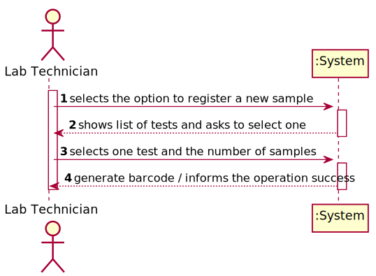
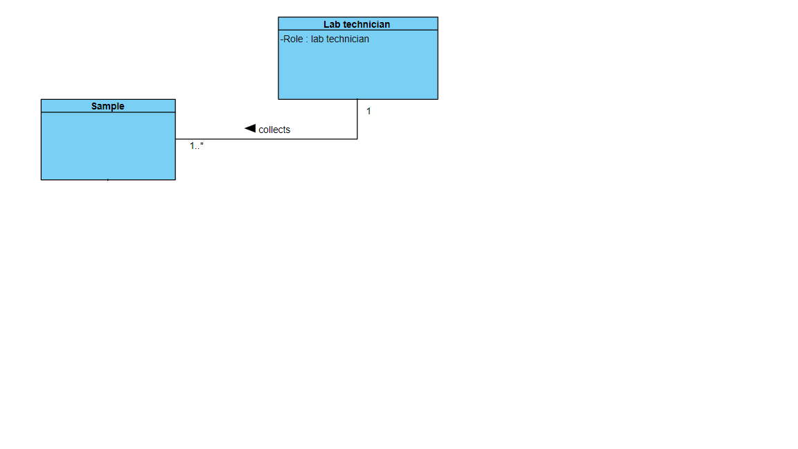
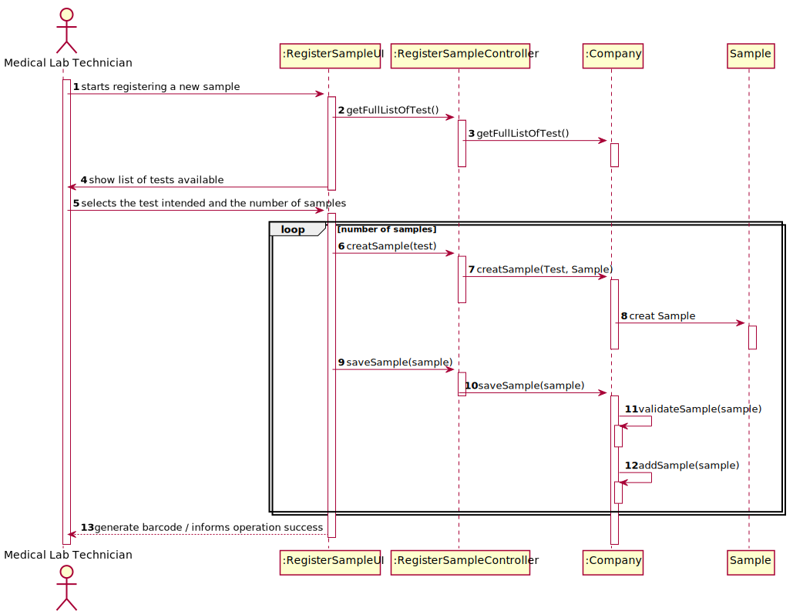
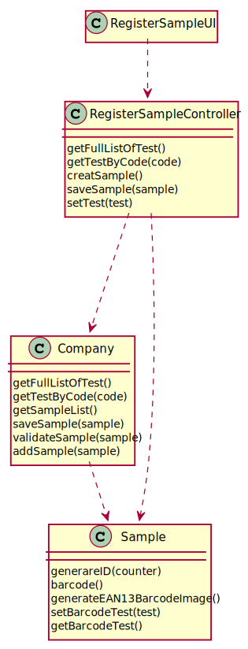

# US 005 - Record the samples

## 1. Requirements Engineering

### 1.1. User Story Description

• US5: As a lab technician, I want to record the samples collected in the scope of a given test.

### 1.2. Customer Specifications and Clarifications

**From the specifications document:**

> n/a

**From the client clarifications:**

> **Question:** What information does the medical lab technician needs to input to the record a new sample?
>
> **Answer:** The medical lab technician checks a list of tests and selects one. Then, the application generates barcodes (one or more). After printing the barcodes (one or more) the use case ends. In my opinion, from the Project Description, rom the requirements of Sprint C and from my previous answers in this forum, you should already have noticed this flow.

-

> **Question:** What kind of attributes should a sample have?
>
> **Answer:** Each sample is associated with a test. A sample has only one attribute, a barcode number (UPC) that is a sequential number and is automatically generated by the system. Each sample has a unique barcode number.

-

> **Question:** Can a test have more than one sample?
>
> **Answer:** Yes

-

> **Question:** We didn't fully understand what will the API do in this US, so here's out interpretation from the US, correct us if we're wrong please: The API will be generated randomly and the API is an attribute from the sample.
>
> **Answer:** The API will be used to generate/print barcodes.

-

> **Question:** During the current sprint, how should we allow the barcodes to be printed. After generating them via the API, should we save the barcode images to the disk?
>
> **Answer:** Each generated barcode should be saved in a folder as a jpeg file.

-

> **Question:** It was answered in one of the previous questions that the sample only has one attribute, the barcode, however the description of the project also mentions a date of collection of the samples, is this date supposed to be an attribute of the test and not of the sample itself?
>
> **Answer:** Yes. The system should record the date (DD/MM/YYYY) and time (HH:MM) when the sample is collect made. The date and time are automatically generated by the system when the barcode is issued.

-

> **Question:** If there were multiple samples for a single test, would there be only one collection date for all of them?
>
> **Answer:** Only one collection date and time for a test.

-

> **Question:** Why is there the specification for only the tests with no samples?
>
> **Answer:** The Medical Lab Technician selects a tests and the number of barcodes he/she wants. Then the system generates the requested barcodes.
After generating the barcodes, the select test is no more available in the system for generating barcodes.

-

> **Question:** After the barcodes are generated. The concept-reality link would be, for example to stick each barcode into each sample?
>
> **Answer:** Yes. Each generated barcode should be saved in a folder as a jpeg file.

-

> **Question:** What is supposed to show to the Medical Lab Technician when he selects the pretended test ?
> 
> **Answer:** Firstly, the Medical Lab Technician checks the system to see the tests/clients that need to be done. Before selecting a test, the Medical Lab Technician checks/see the name of the client and all the test data (test attributes, test type, collection method, parameters, etc.). Then, the Medical Lab Technician selects one test/client and the system asks for the number of samples to collect. Next, the system generates the barcodes to put in the samples.

### 1.3. Acceptance Criteria

* **AC1:** The system should support several barcode APIs. The API to use is defined by configuration.
* **AC2:** Medical lab technician need to be logged in to record the sample collected in the scope fo a given test.
* **AC3:** The Medical lab technician must choose one test
* **AC4:** The Medical lab technician must associate at least one sample to the choosen test

### 1.4. Found out Dependencies

* US04: As a receptionist of the laboratory, I intend to register a test to be performed to a registered client.

### 1.5 Input and Output Data

**Output Data:**

* Generate Barcode
* (In)Success of the operation

### 1.6. System Sequence Diagram (SSD)

### 1.7 Other Relevant Remarks

n/a

## 2. OO Analysis

### 2.1. Relevant Domain Model Excerpt

### 2.2. Other Remarks

n/a

## 3. Design - User Story Realization

### 3.1. Rationale

| Interaction ID | Question: Which class is responsible for... | Answer  | Justification (with patterns)  |
|:-------------  |:--------------------- |:------------|:---------------------------- |
| Step 1  		 |	... interacting with the actor? | RegisterSampleUI  |
| 			  	 |	... coordinating the US? | RegisterEmployeeUIController | Controller                             |
| 			  	 | ... knowing the user using the system?  | UserSession  | Medical Lab Technician |
| 		 		 |							 | Company  | IE: knows/own the Samples|
| Step 2  		 |	...saving the inputted data? | Company | IE: object created in step 1 has its own data.  | 
| Step 3  		 |	... validating all data (local validation)? | RegisterSampleUI| IE: owns its data.| 
| 			  		 |	... validating all data (global validation)? | Sample | IE: knows all the data.| 
| 			  		 |	... saving the created Sample? | Company | IE: knows all Samples.| 
| Step 4  		 |	... informing operation success?| RegisterSampleUI | IE: is responsible for user interactions.  | 

## 3.2. Sequence Diagram (SD)

## 3.3. Class Diagram (CD)

# 4. Tests

    @Test
    public void generateID() {
        int counter = 1;
        String result = Sample.generateID(counter);
        String expresult = "100000000001";
        assertEquals(result, expresult);
    }

    @Test
    public void getTestByCode() {
    Company company = new Company(Constants.PARAMS_COMPANY_DESIGNATION);
    Client cliente = new Client("diogo", 1234567891234567L, 12345678912L, 1234567891L, 1234567891, new Date("2002/3/30"), "Client", new Email("ds@gmail.com"));
    app.domain.model.Test teste = new app.domain.model.Test(cliente, 123L, "123456789123", "Covid", new ArrayList<>(), new ArrayList<>(), 12345L, new Date());
    app.domain.model.Test expresult = company.getTestByCode(123L);
    }

    @Test
    public void validateSample() {
        Company company = new Company(Constants.PARAMS_COMPANY_DESIGNATION);
        Sample sample = null;
        try {
            sample = new Sample();
        } catch (Exception e) {
            e.printStackTrace();
        }
        Boolean result = company.validateSample(sample);
    }

# 5. Construction (Implementation)

## Controller

public class RegisterSampleController {

    /**
     * Initializes company
     */
    private Company company;

    /**
     * Initializes test
     */
    private Test test;

    /**
     * Initializes sample
     */
    private Sample sample;

    /**
     * Gets the company
     */
    public RegisterSampleController(){
        this(App.getInstance().getCompany());
    }

    /**
     * Synchronizes company
     * @param company company instance
     */
    public RegisterSampleController(Company company){
        this.company = company;
        this.test = null;
    }

    /**
     * List of test
     * @return list
     */
    public List<Test> getFullListOfTest(){ return this.company.getTestList(); }

    /**
     * Returns specific test
     * @param code code of test
     * @return test
     */
    public Test getTestByCode(Long code){
        return this.company.getTestByCode(code);
    }

    /**
     * Creates sample
     * @return sample
     */
    public Sample createSample() {
        try {
            return this.company.registSample();
        } catch (Exception e) {
            e.printStackTrace();
        }
        return null;
    }

    /**
     * Returns true if added
     * @param sample added
     * @return boolean result
     */
    public boolean saveSample(Sample sample){
        return this.company.saveSample(sample);
    }

    public void setTest(Test test) {
        this.test = test;
    }

}

## UI

public class RegisterSampleUI {

    private TestStore storeTest = new TestStore();

    private RegisterSampleController registSampleController;
    Scanner ler = new Scanner(System.in);

    public RegisterSampleUI() {
        this.registSampleController = new RegisterSampleController();
    }

    public void run(){
        try{
            System.out.println("\n");
            System.out.println("---------------Medical Lab Technician Menu--------------");
            System.out.println();
            System.out.println("Existent tests in the system without samples:");
            System.out.println(this.storeTest.getTestList());
            if (this.storeTest.getTestList().isEmpty()){
                System.out.println("No test available!");
            }else {
                System.out.println("Please select the code of the test:");
                Long code = ler.nextLong();
                if (this.registSampleController.getTestByCode(code) == null) {
                    System.out.println("There is no test with the inserted code.");
                } else {
                    registSampleController.setTest(this.registSampleController.getTestByCode(code));
                    System.out.println("Test was selected with success!\n");
                    System.out.println("How many samples do you want to regist?");
                    int number = ler.nextInt();
                    for (int i = 0; i < number; i++) {
                        if (this.registSampleController.saveSample(this.registSampleController.createSample())) {
                            System.out.println("The sample was correctly created and associated with the selected test.\n");
                        } else {
                            System.out.println("Failed to add the sample!\n");
                        }
                    }
                }
            }
        }catch (IllegalArgumentException | NullPointerException illegalArgumentException){
            System.out.println(illegalArgumentException.getMessage());
        } catch (Exception e) {
            e.printStackTrace();
        }
    }
}

## Class Organization

public class Sample {

    /**
     * Creates sample
     *
     * @throws Exception exception
     */
    public Sample() throws Exception {
        this.calendar = Calendar.getInstance();
        this.dateSamplesCollected = calendar.getTime();
        this.barcodeText = "";
        generateEAN13BarcodeImage(barcodeText);
    }

    /**
     * Generates barcode
     *
     * @param barcodeText the barcode text
     */
    public void generateEAN13BarcodeImage(String barcodeText) throws Exception {
        Barcode barcode = BarcodeFactory.createEAN13(barcodeText);
        barcode.setPreferredBarHeight(100);
        BarcodeImageHandler.saveJPEG(barcode, new File("Barcodes/Barcode_" + barcodeText + ".jpeg"));
    }

    /**
     * Generates barcode
     *
     * @param barcodeText the barcode text
     * @return image of barcode
     */
    public static BufferedImage generateEAN13BarcodeImage2(String barcodeText) {
        EAN13Bean barcodeGenerator = new EAN13Bean();
        BitmapCanvasProvider canv = new BitmapCanvasProvider(160, BufferedImage.TYPE_BYTE_BINARY, false, 0);

        barcodeGenerator.generateBarcode(canv, barcodeText);
        return canv.getBufferedImage();
    }

    /**
     * Generates barcode
     *
     * @param barcodeText the barcode text
     * @return image of barcode
     */
    public static BufferedImage generateEAN13BarcodeImage3(String barcodeText) {
        EAN13Writer barcodeWriter = new EAN13Writer();
        BitMatrix bitMatrix = barcodeWriter.encode(barcodeText, BarcodeFormat.EAN_13, 300, 150);

        return MatrixToImageWriter.toBufferedImage(bitMatrix);
    }

    /**
     * Generates barcode EAN13
     *
     * @param counter the counter to generate the id
     * @return string
     */
    public static String generateID(int counter) {

        long numbers = 100000000000L + counter;

        return String.valueOf(numbers);
    }

    /**
     * Date of the sample
     *
     * @return date
     */
    public Date getDateSamplesCollected() {
        return dateSamplesCollected;
    }

    /**
     * Textual description of sample
     *
     * @return string of sample
     */
    @Override
    public String toString() {
        return "Sample{" +
                "date=" + dateSamplesCollected +
                ", barcodeText='" + barcodeText + '\'' +
                '}';
    }

    /**
     * Returns string with barcode
     *
     * @return barcode
     */
    public String getBarcodeText() {
        return barcodeText;
    }

    public void setBarcodeText(String barcodeText) {
        this.barcodeText = barcodeText;
    }

}

# 6. Integration and Demo

* A new option on the Lab Technician menu was added.

# 7. Observations

n/a
