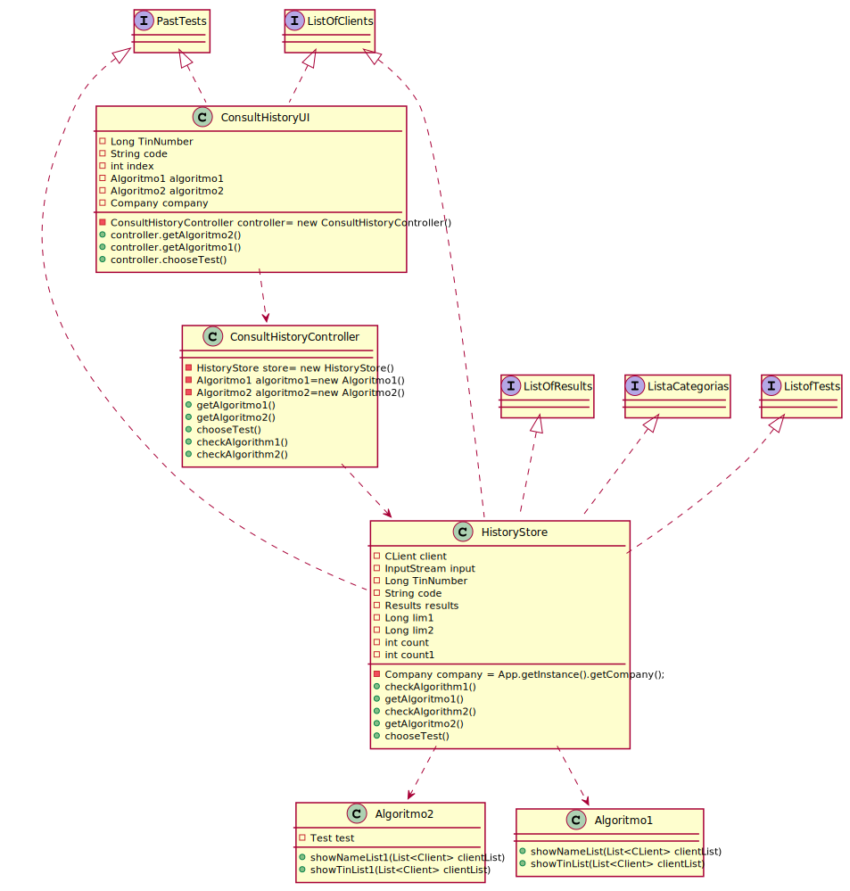

# US 13- Consult Client's History

## 1. Requirements Engineering

### 1.1. User Story Description

As a clinical chemistry technologist, I intend to consult the historical tests
performed by a particular client and to be able to check tests details/results.

### 1.2. Customer Specifications and Clarifications

**From the specifications document:**

>	Each task is characterized by having a unique reference per organization, a designation, an informal and a technical description, an estimated duration and cost as well as the its classifying task category.

>	As long as it is not published, access to the task is exclusive to the employees of the respective organization.

**From the client clarifications:**

> **Question:** Should we show every client already registered when we show the clients' list to the clinical chemistry technologist or should we only show the clients' with a test or more already assigned?
>
> **Answer:** The system should show only clients that have tests already validated by the lab coordinator.

> **Question:**  Should we consider this US valid for these 3 actors as originally stated, or only for the lab coordinator as stated now?
>
> **Answer:** Developing an application, like the one we are developing during the Integrative Project, is dynamic process and the teams should be able to react to change. Moreover, the latest client requests/requirements are those that should be considered. Typically, the client updates the requirements throughout the project development.
Please consider the requirements introduced at the beginning of Sprint D.

> **Question:** Should we show every client already registered when we show the clients' list to the clinical chemistry technologist or should we only show the clients' with a test or more already assigned?
>
> **Answer:** The system should show only clients that have tests already validated by the lab coordinator.

> **Question:**  The client's tests, that we have to show on this US, need to have been validated by the lab coordinator or is it enough if they just have results and we can show them before being validated by the lab coordinator?
>
> **Answer:** The tests to be presented in US13 are tests that have already been validated by the lab coordinator.

### 1.3. Acceptance Criteria

* **AC1:** The application must allow ordering the clients by TIN and
  by name to help the clinical chemistry technologist choose the target client. The
  ordering algorithm to be used by the application must be defined through a
  configuration file. At least two sorting algorithms should be available

### 1.4. Found out Dependencies

* There is a dependency with US15 since it can only shows tests that are already validated.

### 1.5 Input and Output Data

**Input Data:**

* Typed data:
  * Tax Number
  * Code  

* Selected data:
    * Client
    * Sort Method
    * Test

**Output Data:**

* Result of an past test with the comparance of reference values

### 1.6. System Sequence Diagram (SSD)

**Alternative 1**

**Other alternatives might exist.**

### 1.7 Other Relevant Remarks

## 2. OO Analysis

### 2.1. Relevant Domain Model Excerpt

### 2.2. Other Remarks

n/a

## 3. Design - User Story Realization

### 3.1. Rationale

**SSD - Alternative 1 is adopted.**

| Interaction ID | Question: Which class is responsible for... | Answer  | Justification (with patterns)  |
|:-------------  |:--------------------- |:------------|:---------------------------- |
| Step 1  		 |	... interacting with the actor? | CreateTaskUI   |  Pure Fabrication: there is no reason to assign this responsibility to any existing class in the Domain Model.           |
| 			  		 |	... coordinating the US? | CreateTaskController | Controller                             |
| 			  		 |	... instantiating a new Task? | Organization   | Creator (Rule 1): in the DM Organization has a Task.   |
| 			  		 | ... knowing the user using the system?  | UserSession  | IE: cf. A&A component documentation.  |
| 			  		 |	... knowing to which organization the user belongs to? | Platform  | IE: has registed all Organizations |
| 			  		 |							 | Organization   | IE: knows/has its own Employees|
| 			  		 |							 | Employee  | IE: knows its own data (e.g. email) |
| Step 2  		 |							 |             |                              |
| Step 3  		 |	...saving the inputted data? | Task  | IE: object created in step 1 has its own data.  |
| Step 4  		 |	...knowing the task categories to show? | Platform  | IE: Task Categories are defined by the Platform. |
| Step 5  		 |	... saving the selected category? | Task  | IE: object created in step 1 is classified in one Category.  |
| Step 6  		 |							 |             |                              |              
| Step 7  		 |	... validating all data (local validation)? | Task | IE: owns its data.| 
| 			  		 |	... validating all data (global validation)? | Organization | IE: knows all its tasks.| 
| 			  		 |	... saving the created task? | Organization | IE: owns all its tasks.| 
| Step 8  		 |	... informing operation success?| CreateTaskUI  | IE: is responsible for user interactions.  | 

### Systematization ##

According to the taken rationale, the conceptual classes promoted to software classes are:

* History Store

Other software classes (i.e. Pure Fabrication) identified:

* ConsultHistoryUI
* ConsultHistoryController
* Algoritmo1
* Algoritmo2

## 3.2. Sequence Diagram (SD)

**Alternative 1**

**Alternative 2**

## 3.3. Class Diagram (CD)

**From alternative 1**

# 4. Tests

**Test 1:** Check that it is not possible to create an instance of the Task class with null values.

	@Test(expected = IllegalArgumentException.class)
		public void ensureNullIsNotAllowed() {
		Task instance = new Task(null, null, null, null, null, null, null);
	}

**Test 2:** Check that it is not possible to create an instance of the Task class with a reference containing less than five chars - AC2.

	@Test(expected = IllegalArgumentException.class)
		public void ensureReferenceMeetsAC2() {
		Category cat = new Category(10, "Category 10");
		
		Task instance = new Task("Ab1", "Task Description", "Informal Data", "Technical Data", 3, 3780, cat);
	}

*It is also recommended to organize this content by subsections.*

# 5. Construction (Implementation)

## Class CreateTaskController

		public boolean createTask(String ref, String designation, String informalDesc, 
			String technicalDesc, Integer duration, Double cost, Integer catId)() {
		
			Category cat = this.platform.getCategoryById(catId);
			
			Organization org;
			// ... (omitted)
			
			this.task = org.createTask(ref, designation, informalDesc, technicalDesc, duration, cost, cat);
			
			return (this.task != null);
		}

## Class Organization

		public Task createTask(String ref, String designation, String informalDesc, 
			String technicalDesc, Integer duration, Double cost, Category cat)() {
		
	
			Task task = new Task(ref, designation, informalDesc, technicalDesc, duration, cost, cat);
			if (this.validateTask(task))
				return task;
			return null;
		}

# 6. Integration and Demo

* A new option on the Clinical Chemistry Technologist menu was added to consult client's history tests

# 7. Observations

