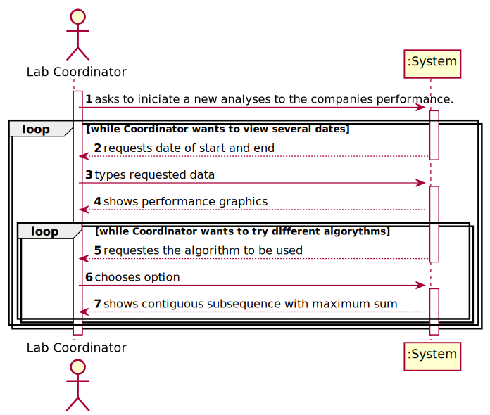

# US 016 - Overview of all tests performed

## 1. Requirements Engineering

### 1.1. User Story Description

• US16: As a laboratory coordinator, I want to have an overview of all the tests performed
by Many Labs and analyse the overall performance of the company. To facilitate
overall analysis, the application should also display statistics and graphs.

### 1.2. Customer Specifications and Clarifications

**From the specifications document:**

> "...the company wants
to decrease the number of tests waiting for its result. To evaluate this, it proceeds as following: for
any interval of time, for example one week (6 working days with 12 working hours per day), the
difference between the number of new tests and the number of results available to the client during
each half an hour period is computed. In that case, a list with 144 integers is obtained, where a
positive integer means that in such half an hour more tests were processed than results were
obtained, and a negative integer means the opposite. Now, the problem consists in determining what
the contiguous subsequence of the initial sequence is, whose sum of their entries is maximum. This
will show the time interval, in such week, when the company was less effective in responding."

**From the client clarifications:**

> **Question:** Should the interval of time considered for the evaluation be asked to the Laboratory Coordinator?
>
> **Answer:** Yes.

-

> **Question:** How should we ask him the interval of time to be considered? Should we ask him to type a number of days? A number of weeks? Should we give general options like: last week, last month..., for him to select from?  In case the Laboratory Coordinator chooses, for example, one week, should we consider the last 7 days, or should we consider, for example, the data from monday to sunday?
>
> **Answer:** The laboratory coordinator should introduce two dates that define an interval, the beginning date and the end date. This interval will be used to find the contiguous subsequence with maximum sum.

-

> **Question:** What is the meaning of "overview" here? Should the laboratory coordinator see the number of tests waiting for samples, the number of tests waiting for results, the number of tests waiting for diagnoses... Or should he see the information available for each one of the tests in the application?
>
> **Answer:** The laboratory coordinator should be able to check the number of clients, the number of tests waiting for results, the number of tests waiting for diagnosis and the total number of tests processed in the laboratory in each day, week, month and year. Moreover, the laboratory coordinator should be able to check the contiguous subsequence with maximum sum.

-

> **Question:** When referring to "the application should also display statistics and graphs" is it up to the team to decide which API or resource should be used to generate graphs and statistics, or do you prefer something specific?
>
> **Answer:** With JavaFX you can draw high quality graphs and there is no need to use other tools.

-

> **Question:** After the Laboratory Coordinator types the requested data and views the analysis of the company performance, should he be able to re-type different data and view the results for a different interval of time and/or algorithm? To make the re-type of the data easier, should there be a "clear" button, that is responsible for clearing the text fields for data entry?
>
> **Answer:** The laboratory coordinator should be able to explore different parameter values (settings) and check the results. Each team should prepare a simple and intuitive interface that requires a minimum number of interactions with the user.

-

> **Question:** You said in this Q&A https://moodle.isep.ipp.pt/mod/forum/discuss.php?d=8831, that the laboratory coordinator should define an interval, the beginning date and the end date. Can we assume that every day in the interval defined by the coordinator is a working day with 12 working hours each?
>
> **Answer:** Yes.

-

> **Question:** If Saturday or Sunday are in the interval should we skip them or count them also as working days?
>
> **Answer:** Sunday is not a working day. All the other days of the week are working days.

-

> **Question:** "For example one week (6 working days with 12 working hours)". In this case, is there any specifc hour to start filling the 144 integers list?
>
> **Answer:** A working day is from 8h00 to 20h00.

### 1.3. Acceptance Criteria

* **AC1:** While evaluating the performance the laboratory
  coordinator should have the ability to dynamically select the algorithm to be
  applied from the ones available on the system (the benchmark algorithm provided
  in moodle and the brute-force algorithm to be developed). 
* **AC2:** Support for easily adding other similar algorithms is required.

### 1.4. Found out Dependencies

* US4: As a receptionist of the laboratory, I intend to register a test to be performed to a
  registered client.
* US5: As a medical lab technician, I want to record the samples collected in the scope of a
  given test.
* US12: As a clinical chemistry technologist, I intend to record the results of a given test.
* US14: As a specialist doctor, I intend to make the diagnosis and write a report for a given
  test.

### 1.5 Input and Output Data
**Input Data:**

* Start date to analyse;
* End date to analyse;

**Output Data:**

* contiguous subsequence with maximum sum
* statistics and graphs
* (In)Success of the operation

### 1.6. System Sequence Diagram (SSD)

### 1.7 Other Relevant Remarks

n/a

## 2. OO Analysis

### 2.1. Relevant Domain Model Excerpt

### 2.2. Other Remarks

n/a

## 3. Design - User Story Realization

### 3.1. Rationale

| Interaction ID | Question: Which class is responsible for... | Answer  | Justification (with patterns)  |
|:-------------  |:--------------------- |:------------|:---------------------------- |
| Step 1  		 |	... interacting with the actor? | PerformanceUI  |
| 			  	 |	... coordinating the US? | PerformanceController | Controller                             |
| 	Step 2		  	 |   |   |  |
|   Step 3 		 |	...saving the inputted data? | PerformanceStore | IE: PerformanceStore uses data.  | 
|  	Step 4	 |	...show performance graphics?  | PerformanceStore| PerformanceStore generates graphs.| 
| 	Step 5		  		 |	 |  | | 
| 	Step 6		  		 |	 |  | | 
|   Step 7		 |	... informing operation success?| RegisterSampleUI | IE: is responsible for user interactions.  | 

## 3.2. Sequence Diagram (SD)

## 3.3. Class Diagram (CD)

# 4. Tests

    public class PerformanceStoreTest {

    PerformanceStore performanceStore = new PerformanceStore();
    Date start = new Date("2021/5/10");
    Date end = new Date("2021/5/20");

    @Test
    public void getTests() { performanceStore.getTests(1, start, end ); }
    @Test
    public void getTests2() { performanceStore.getTests(2, start, end); }

    @Test
    public void getStatistics() { performanceStore.getStatistics(start, end); }

    @Test
    public void createArray() { performanceStore.createArray(start, end); }
    }

# 5. Construction (Implementation)

## Controller

    public class PerformanceController {

    public void getStatistics(Date start, Date end){
        
    }

    public int[] getSubarray(int option, Date start, Date end){
        
    }
    }

## UI
    public class PerformanceUI implements Runnable {

    @Override
    public void run() {
        boolean bol=false;
        
            *ask start date*

            *ask end date*

            controller.getStatistics(startDate, endDate);
            boolean bol1=false;
            int option;

            
                *choose algorithm*

                if (BruteAlgorithm){
                   *print max sum array*
                }else if (SUM){
                    *print max array*
                }else System.out.println("Insert a valid option");

      }
    }

## Store

    public class PerformanceStore {

    public int[] getTests(int option, Date start, Date end){
        *get max sum array with chosen algorithm*
    }

    public void getStatistics(Date start, Date end){
       *statistics for days, weeks, months and years*
    }

    public int[] createArray(Date start, Date end){
        *create array to be analysed by algorithms*
    }

    }

# 6. Integration and Demo

* A new option to the Administrator Menu was added.
* After logging in as an Administrator, you need to select the "Check Performance" option to proceed.

# 7. Observations

* The statistics must show four graphics for the number of clients, registered tests, tests with results and validated tests.
* One graphic for days, one for weeks, one for months and one for years.
