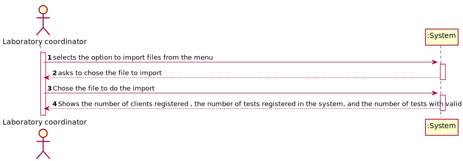
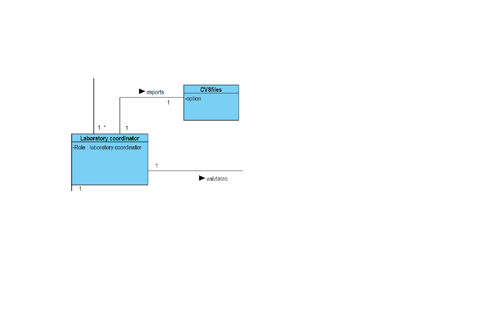
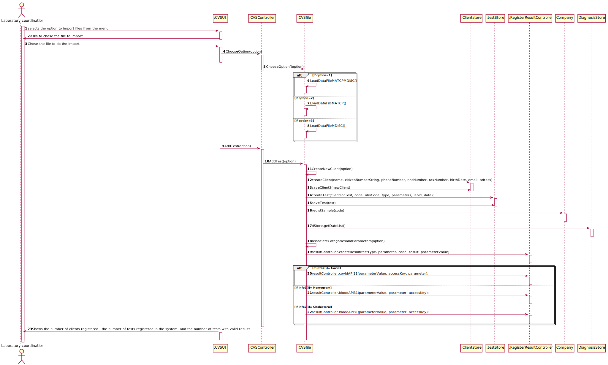
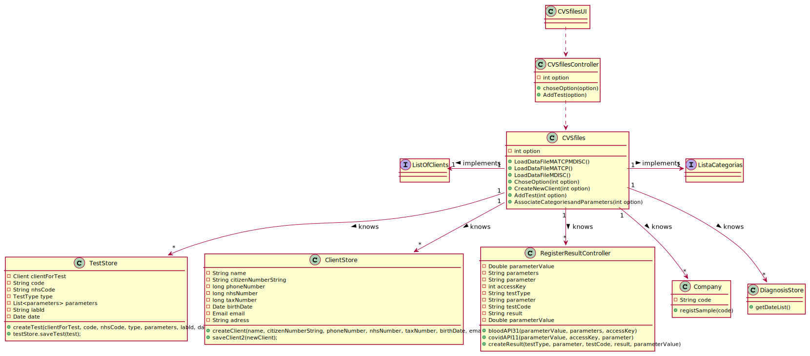

# US 17 - Import clinical tests from a cvs file

## 1. Requirements Engineering

### 1.1. User Story Description

• : As a laboratory coordinator, I want to import clinical tests from a CSV file

### 1.2. Customer Specifications and Clarifications 

**From the specifications document:**

>	

**From the client clarifications:**

>**Question**: In what folder should the CSV file be when we want to use the application through the console?
>
>**Answer**: In this sprint each team should develop a graphical user interface. The file to import can be located in any folder. The user should specify the path of the file.
>
>**Question**:If some kind of data is wrong, what should happen should we just ignore the line where it is located
>
>**Answer**: The application should not load tests that have incorrect attribute values. The application should identify the tests that have incorrect values and it should continue loading all valid tests that exist in the file. A message should be sent to the console to identify the tests/lines that have incorrect values.
>
>**Question**:Should we show the data that the laboratory coordinator is importing?
>
>**Answer**: Yes, it should show all the data that was imported at that time.
>
>**Question**: if a labID on the CSV file isn't found on the system, should we consider it "invalid data"?
>
>>**Answer**: Yes. To import tests of any laboratory (with a given Lab_ID), it is required that a laboratory having the given Lab_ID exists in the system.
Therefore, if you want to import data from a given laboratory, you should use the application to create that laboratory in the system. Then you should import the data.
When creating a laboratory in the system, you should use the given Lab_ID (available in the CSV file) and define the other attributes using valid data. In this project, we are NOT going to import data from laboratories (or other entities) to reduce the amount of hours required to develop and deliver a working application to the client.
What I say in this message is valid for the laboratories and for other entities that appear in the CSV files.
>**Question**: But during the last Sprint you mentioned a registration date also. Considering we could have more clients than the number that a Many Labs specific laboratory could deal in a day, then the registration date could be different than the sample collection date. My question is thus: Should the tests have a registration date plus sample collection date?
>
>**Answer**: You should use the Test_Reg_DateHour as the sample collection date.
>
>**Question**:Will the CSV files always have the same format as the ones available on moodle?
>
>**Answer**: Yes. But we can have more categories and parameters for each type of test.
>
>**Question**:In the CSV files provided for this sprint we can find a parameter with code HDL00 which belongs to the Cholesterol category and to the blood test type, but by searching the external modules for the blood test type the team could not find a match for the said parameter. What can we as a team do to resolve such issue?
>
>**Answer**: If the API does not have reference values for this parameter, than you should not present the reference values to the application user.
>
>**Question**: When loading a .csv file after another .csv has been loaded beforehand, do we keep the tests that were loaded previously or do we replace them with the new tests being loaded from the new .csv?
>
>**Answer**: The tests should not be deleted after being loaded.
>
>**Question**: when importing a test and associating it to the client, should the client exist beforehand or should we import the client with the information given on the CSV file?
>
>**Answer**: Different from what I asked for the other entities (like the lab), when importing the CSV data, if the client does not exist in the system, then the client should be created using the data available in the CSV file.
>
>**Question**:Should we write some kind of report or should we just leave the report field empty and simply add the date?
>
>**Answer**:Leave empty and simply add the date.
>
>**Question**: In us9 you said in relation to the test types that "The code is not automatically generated". However, if we are creating a new test type, because of the excel file, for example a urine test type, we don't have any code for that test type in the excel file, in that case do we create it automatically or how do we do it?
>
>**Answer** In a previous post I already gave an answer to this question. If a urine test type is available in the CSV file, each team should create this type of test in the system before loading the data.

### 1.3. Acceptance Criteria

* **AC1:** If the file contains invalid data (e.g., a parameter not
           defined in the system), that data should not be load into the system. An exception
           should be thrown.

### 1.4. Found out Dependencies

* This User Story is related with the User Stories 3 ,4 and 12

### 1.5 Input and Output Data

**Input Data:**

* Typed data:
	Option to choose the pretended file to import
    
* Selected data:
	* CVS file

**Output Data:**

* the number of clients registered , the number of tests registered in the system, and the number of tests with valid results

### 1.6. System Sequence Diagram (SSD)

**Alternative 1**

**Other alternatives might exist.**

### 1.7 Other Relevant Remarks

* .

## 2. OO Analysis

### 2.1. Relevant Domain Model Excerpt 

### 2.2. Other Remarks

n/a

## 3. Design - User Story Realization 

### 3.1. Rationale

**SSD - Alternative 1 is adopted.**

| Interaction ID | Question: Which class is responsible for... | Answer  | Justification (with patterns)  |
|:-------------  |:--------------------- |:------------|:---------------------------- |
| Step 1  		 |	... select the option to import the file| Laboratory coordinator  |  Pure Fabrication: there is no reason to assign this responsibility to any existing class in the Domain Model.           |
| 			  		 |	... coordinating the US? |CvsfilesController | Controller                             |
| Step 2  		 |				... requesting the data	?		 |    CVSfilesUI         |                              |
| Step 3  		 |	...typing the requested data? | Laboratory coordinator |   |
| Step 4  		 | ...showing the data?	 | CvsfilesUI|                         |              

### Systematization ##

According to the taken rationale, the conceptual classes promoted to software classes are: 

 * CVSfiles
 

Other software classes (i.e. Pure Fabrication) identified: 

 
 * CVSfilesUI
 * CVSfilesController

## 3.2. Sequence Diagram (SD)

**Alternative 1**

## 3.3. Class Diagram (CD)

**From alternative 1**

# 4. Tests 

 @Test
    public void loadDataFileMATCPMDISC() {
        try {
            BufferedReader reader = new BufferedReader(new FileReader("C:\\Users\\Utilizador\\Documents\\lei-21-s2-1df-g25\\ficheiros de import\\tests_BloodCovidMATCPMDISCCSV.csv"));
        } catch (FileNotFoundException e) {
            e.printStackTrace();
        }
    }

   @Test
   public void loadDataFileMATCP() {
        try {
            BufferedReader reader = new BufferedReader(new FileReader("C:\\Users\\Utilizador\\Documents\\lei-21-s2-1df-g25\\ficheiros de import\\tests_CovidMATCPCSV.csv"));
        } catch (FileNotFoundException e) {
            e.printStackTrace();
        }
    }

   @Test
    public void loadDataFileMDISC() {
        try {
            BufferedReader reader = new BufferedReader(new FileReader("C:\\Users\\Utilizador\\Documents\\lei-21-s2-1df-g25\\ficheiros de import\\tests_BloodMDISCCSV.csv"));
        } catch (FileNotFoundException e) {
            e.printStackTrace();
        }
    }

   @Test
    public void choseOption() {
        try {
            cvsfiles.ChoseOption(1);
        } catch (FileNotFoundException e) {
            e.printStackTrace();
        }
        try {
            cvsfiles.ChoseOption(2);
        } catch (FileNotFoundException e) {
            e.printStackTrace();
        }
        try {
            cvsfiles.ChoseOption(3);
        } catch (FileNotFoundException e) {
            e.printStackTrace();
        }
    }

   @Test
    public void createNewClient() throws IOException {
        cvsfiles.CreateNewClient(1);
        cvsfiles.CreateNewClient(2);
        cvsfiles.CreateNewClient(3);
    }

   @Test
    public void addTest() {
        cvsfiles.AddTest(1);
        cvsfiles.AddTest(2);
        cvsfiles.AddTest(3);
    }

# 5. Construction (Implementation)

## Class CVSfilesController 
  public CVSfilesController(){
    
}

   public CVSfilesController(Company company) {
   
   }

public void choseOption(int option)  {
  
}

   public void AddTest(int option){
        
   }

	

## Class CVSfiles
 public  BufferedReader LoadDataFileMATCPMDISC()  {

   }
public  BufferedReader LoadDataFileMATCP() throws FileNotFoundException{
      
   }
    public  BufferedReader LoadDataFileMDISC()throws FileNotFoundException{
      
   }

   public BufferedReader ChoseOption(int option) throws FileNotFoundException {

    
   }

   public void CreateNewClient(int option) {

}

   public Test AddTest(int option){
       
  }

   

   public void AssociateCategoriesandParameters(int option)  {
       
 }

		

# 6. Integration and Demo 

A new option was added to the laboratory coordinator menu
The Laboratory Coordinator needs to choose the second option on his menu to import a file
# 7. Observations

The output of this option is the number of clients registred, the number of valid tests and the number of tests with valid results.

