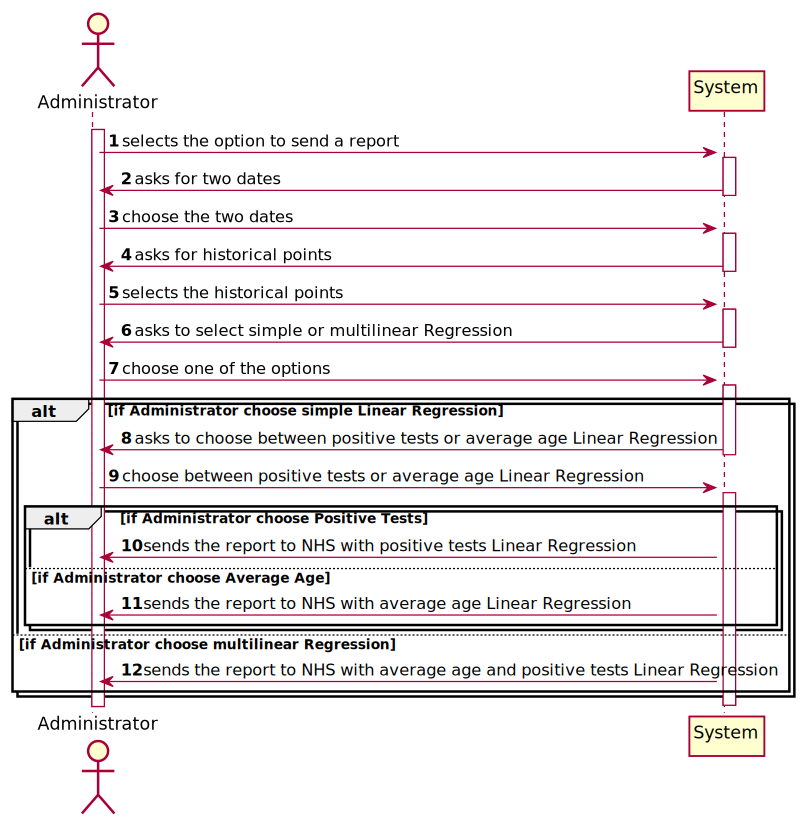
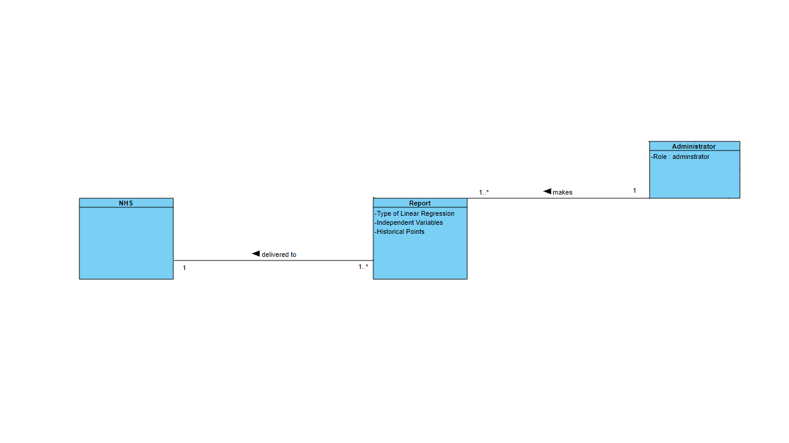
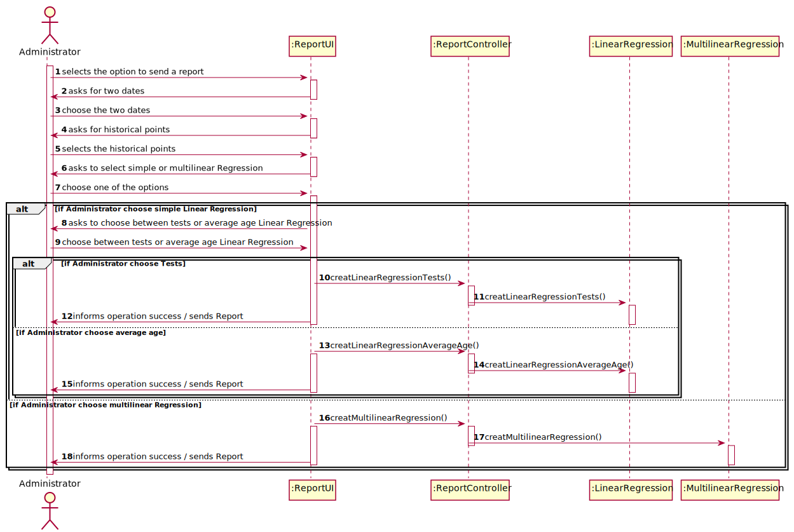
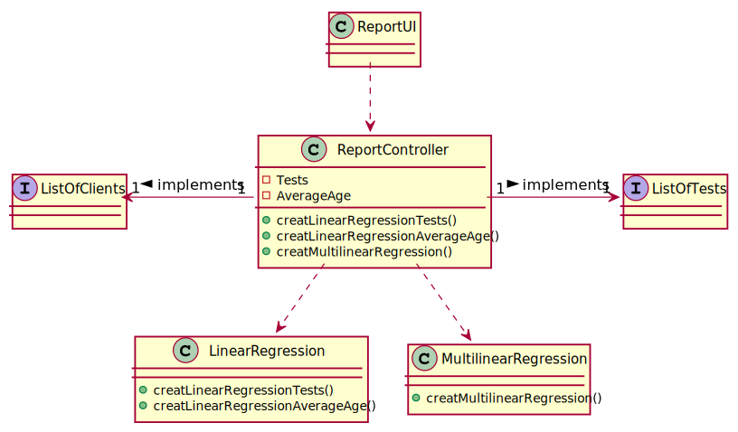

# US 018 - As an Administrator i want to send the Covid-19 report to NHS 

## 1. Requirements Engineering

### 1.1. User Story Description

• US18: As an Administrator I want to send the Covid-19 report to the NHS at any time. I
want to define the interval of dates to fit the regression model, the number of historical
points (number of days or number of weeks) that must be sent to the NHS, the regression
model to use and select the independent variables to use

### 1.2. Customer Specifications and Clarifications

**From the specifications document:**

> Considering that Many Labs has the exclusivity to perform Covid-19 tests, and that the contract
with the NHS in England requires Many Labs to summarize and report Covid-19 data, the company
needs to: identify the number of Covid-19 tests performed, identify all positive results to Covid-19
tests, report the total number of Covid-19 cases per day, per week and per month of the year, and
send the forecasts for these same time horizons (the number of Covid-19 cases for the following
day, next week and next month). 

**From the client clarifications:**

> **Question:** Which significance level should we use for the hypothesis tests?
> 
> **Answer:** The application should allow the user to choose the significance level.

---

> **Question:** Regarding US18 and US19, it is only one report containing all the tests performed by Many Labs to be sent each time, correct? Or is it one report per laboratory, for example? Or other option?
>
> **Answer:** The report should contain all the tests made by Many Labs.

---

> **Question:** Should the report contain the data of all the tests with results (with or without report, with or without validation) or contain only the validated tests? (Or other option?)
>
> **Answer:** The NHS Covid report should include statistics computed only from validated tests.

---

> **Question:** rom Sprint D requirements we get "I want to define... the number of historical points (number of days or number of weeks) that must be sent to the NHS".
Is the Administrator who must choose between days or weeks? If so, how should he make this choice?
>
> **Answer:** Yes. The Administrator should select between days and weeks using the user interface.

---

> **Question:** Should the number of historical points have the same range as the date interval defined by the administrator?
>
> **Answer:** No. The points within the interval are used to fit the linear regression model. The number of historical points are the points for which we want to send the estimates/expect values to NHS. The points within the interval and historical points can overlap. Please carefully review the report example file available in moodle.

---

> **Question:** From the covid report example you gave us we can see that is missing two dates(16/05/2021 and 23/05/2021) in the predictions table. Is there any specific reason?
>
> **Answer:** These days of the week are two Sundays and the laboratory does not work on Sundays.

---

> **Question:** Could you clarify how the historical points work? Acording to the NhsReportExample, it was chosen 15 points and the dates to fit the regression model but it seems that it was not chosen the day to start the prediction table.
> 
> **Answer:** n the header of the exampleNHSReport.txt file it says "If the administrator selects: The current day to be 31/05/2021...". Please relate this information with the table available in the exampleNHSReport.txt file.
In US19, the current day is the day when the report is sent automatically to the NHS.

---

> **Question:** I read from a previous post that " to apply mlr you need two independent variables- daily number tests and mean age person tested daily. Also you need the same records per week. " so when de administrator selects a MLR the system should adopt by default that the independent variables are daily number tests and mean age person , or he should write or select the independent variables that he wants ?
>
> **Answer:** When the Administrator selects MLR, the number tests and mean age independent variables should be used without being selected.

---

> **Question:**  I know that the administrator chose 15 historical points and it is shown in the table down below in the file, but my question is, what's the criteria for showing 3 days before 17/05 and 6 days after 22/05?
>
> **Answer:** The interval data is used to fit the regression model. The historical points are defined to get the number of ESTIMATED positive cases. Please study MATCP and linear regression.

---

> **Question:** Should I find the line/equation (and everything else derived from it) using the data concerning the interval of days chosen, or from the historical days chosen?
>
> **Answer:** The interval data is used to fit the regression model.

### 1.3. Acceptance Criteria

* **AC1:** The report should include day and week (observed and
  estimated) values, the regression model used to estimate each value, R(SLR), R2
  and R2 adjusted for SLR and MLR, hypothesis tests for regression coefficients
  significance model with Anova.
* **AC2:** Simple linear and multilinear regression models
  can be used to compute the estimates and corresponding confidence intervals.
  When the system is configured to use the simple linear regression model, the
  performance of each model should be used to select the best model (the one that
  uses the number of tests realized or the one that uses the mean age as independent
  variable). The best model will be used to make the estimated/expected values that
  will be send to NHS.
* **AC3:** The interval of dates to fit the regression model and the
  number of historical points (number of days and number of weeks) must be
  defined through a configuration file.
* **AC4:** The system should allow the Administrator to select
  between a simple linear and multilinear regression model to fit the data.
  Moreover, the Administrator should be able to choose the independent variable to
  use with the simple linear regression model (either the number of tests realized or
  the mean age). The system should send the report using the NHS API (available
  in moodle).

### 1.4. Found out Dependencies

n/a

### 1.5 Input and Output Data

**Output Data:**

* Reports of Covid-19 data
* (In)Success of the operation

### 1.6. System Sequence Diagram (SSD)

### 1.7 Other Relevant Remarks

n/a

## 2. OO Analysis

### 2.1. Relevant Domain Model Excerpt

### 2.2. Other Remarks

n/a

## 3. Design - User Story Realization

### 3.1. Rationale

| Interaction ID | Question: Which class is responsible for... | Answer  | Justification (with patterns)  |
|:-------------  |:--------------------- |:------------|:---------------------------- |
| Step 1  		 |	... interacting with the actor? | ReportUI  |
| 			  	 |	... coordinating the US? | ReportController | Controller                             |
| 			  	 | ... knowing the user using the system?  | UserSession  | Administrator |
| Step 2  		 |	...saving the inputted data? | ReportUI | IE: object created in step 1 has its own data.  | 
| Step 3  		 |	... validating all data (local validation)? | ReportUI| IE: owns its data.| 
| 			  		 |	... validating all data (global validation)? | LinearRegression and MultilinearRegression | | 
| 			  		 |	... saving the created Sample? | LinearRegression and MultilinearRegression | | 
| Step 4  		 |	... informing operation success?| ReportUI | IE: is responsible for user interactions.  | 

## 3.2. Sequence Diagram (SD)

## 3.3. Class Diagram (CD)

# 4. Tests

# 5. Construction (Implementation)

## Controller

public class ReportController {

}

## UI

public class ReportUI {

}

## Class Organization

public class LinearRegression {

}

public class MultilinearRegression {

}

# 6. Integration and Demo

* The Administrator will send a report to NHS with historical data, at any time.

# 7. Observations

* The report also can be sent to the NHS automatically, at 6:00 am.
