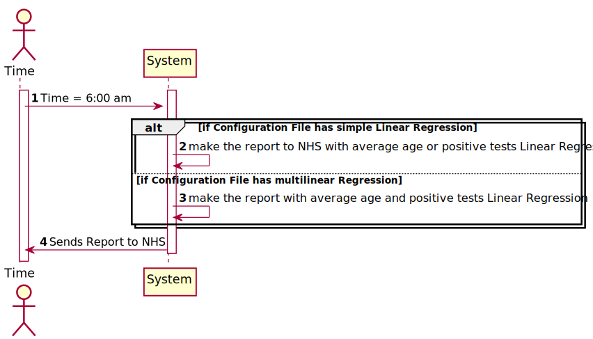
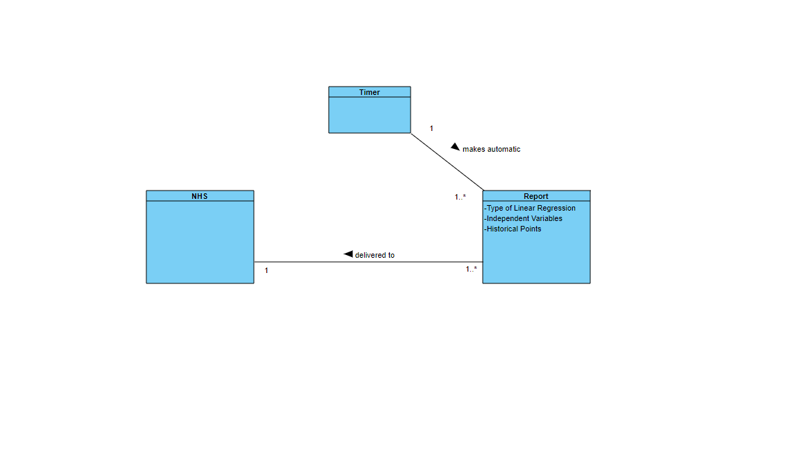
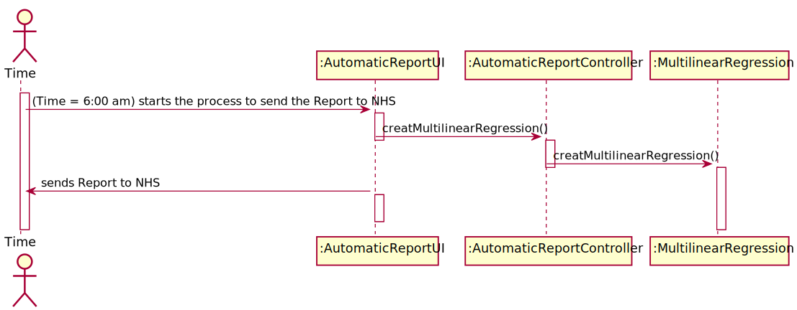
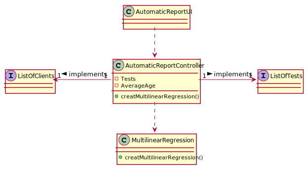

# US 019 - Send the Covid-19 report to NHS every day at 6:00 a.m.

## 1. Requirements Engineering

### 1.1. User Story Description

• US19: The Many Labs company wants to send to the NHS daily reports of Covid-19
data, including the number of observed values and estimated values. Reports should be generated automatically with historical data and must be sent every day at 6:00 am.

### 1.2. Customer Specifications and Clarifications

**From the specifications document:**

> Considering that Many Labs has the exclusivity to perform Covid-19 tests, and that the contract
with the NHS in England requires Many Labs to summarize and report Covid-19 data, the company
needs to: identify the number of Covid-19 tests performed, identify all positive results to Covid-19
tests, report the total number of Covid-19 cases per day, per week and per month of the year, and
send the forecasts for these same time horizons (the number of Covid-19 cases for the following
day, next week and next month). The company is also required to generate daily (automatic) reports
with all the information demanded by the NHS and should send them to the NHS using their API.

**From the client clarifications:**

> **Question:** As the report is generated automatically, should the system generate a notication that the report was sent?
> 
> **Answer:** The application should write the event into a log file.

---

> **Question:** Which class is responsible for creating the scheduler(s)? Should we assume the report scope is Many Labs or is it each laboratory?
>
> **Answer:** Many Labs Many has exclusivity for doing Covid-19 tests and should send nationwide reports to NHS. The scope is Many Labs.

---

> **Question:** In the context of sprint D US19 and US18. We are a group without MATCP and MATDISC. What parameters should we use in the config files if we dont have to implement things related to Math curricular units?
>
> **Answer:** US19 and US18 are US associated only with MATCP. Please check the requirements introduced in Sprint D and the NHS report example available in moodle. You can easily find the parameters required for these user stories.

---

> **Question:** From the report example we got that the administrator defines the dates interval to fit the model. Which date should the application use to provide the report? Is it the registration date or results registration date?
>
> **Answer:** The registration date should be considered. But only tests that have already been validated should be considered.

---

> **Question:** Should the number of historical points have the same range as the date interval defined by the administrator?
>
> **Answer:** No. The points within the interval are used to fit the linear regression model. The number of historical points are the points for which we want to send the estimates/expect values to NHS. The points within the interval and historical points can overlap. Please carefully review the report example file available in moodle.

### 1.3. Acceptance Criteria

* **AC1:** The report should include day and week (observed and
  estimated) values, the regression model used to estimate each value, R(SLR), R2
  and R2 adjusted for SLR and MLR, hypothesis tests for regression coefficients
  significance model with Anova. 
* **AC2:** Simple linear and multilinear regression models
  can be used to compute the estimates and corresponding confidence intervals.
  When the system is configured to use the simple linear regression model, the
  performance of each model should be used to select the best model (the one that
  uses the number of tests realized or the one that uses the mean age as independent
  variable). The best model will be used to make the estimated/expected values that
  will be send to NHS. 
* **AC3:** The interval of dates to fit the regression model and the
  number of historical points (number of days and number of weeks) must be
  defined through a configuration file.
* **AC4:**  The system should send the report using the
  NHS API (available in moodle).

### 1.4. Found out Dependencies

* • US18: As an Administrator I want to send the Covid-19 report to the NHS at any time. I
  want to define the interval of dates to fit the regression model, the number of historical
  points (number of days or number of weeks) that must be sent to the NHS, the regression
  model to use and select the independent variables to use

### 1.5 Input and Output Data

**Output Data:**

* Reports of Covid-19 data 
* (In)Success of the operation

### 1.6. System Sequence Diagram (SSD)

### 1.7 Other Relevant Remarks

n/a

## 2. OO Analysis

### 2.1. Relevant Domain Model Excerpt

### 2.2. Other Remarks

n/a

## 3. Design - User Story Realization

### 3.1. Rationale

| Interaction ID | Question: Which class is responsible for... | Answer  | Justification (with patterns)  |
|:-------------  |:--------------------- |:------------|:---------------------------- |
| Step 1  		 |	... interacting with the actor? | None  |
| 			  	 |	... coordinating the US? | AutomaticReportController | Controller                             |
| 			  	 | ... knowing the user using the system?  | None  |  |
| Step 2  		 |	...saving the inputted data? | AutomaticReportUI | IE: object created in step 1 has its own data.  | 
| Step 3  		 |	... validating all data (local validation)? | AutomaticReportUI| IE: owns its data.| 
| 			  		 |	... validating all data (global validation)? | MultilinearRegression | | 
| 			  		 |	... saving the created Sample? | MultilinearRegression | | 
| Step 4  		 |	... informing operation success?| AutomaticReportUI | IE: is responsible for user interactions.  | 

## 3.2. Sequence Diagram (SD)

## 3.3. Class Diagram (CD)

# 4. Tests

# 5. Construction (Implementation)

## Controller

public class AutomaticReportController {

}

## UI

public class AutomaticReporUI {

   

}

## Class Organization

public class MultilinearRegression {

}

# 6. Integration and Demo

* The system will generate a report automatically with historical data, every day at 6:00 am.

# 7. Observations

* The report also can be sent to the NHS by the Administrator, at any time.
